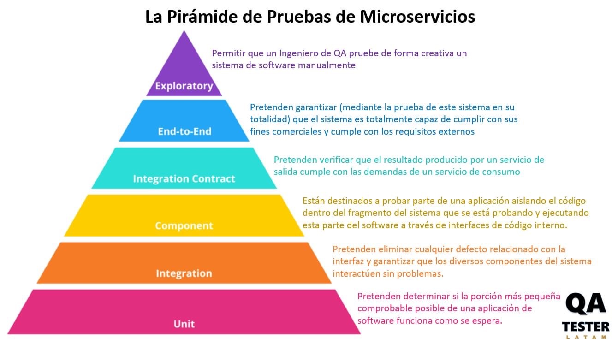
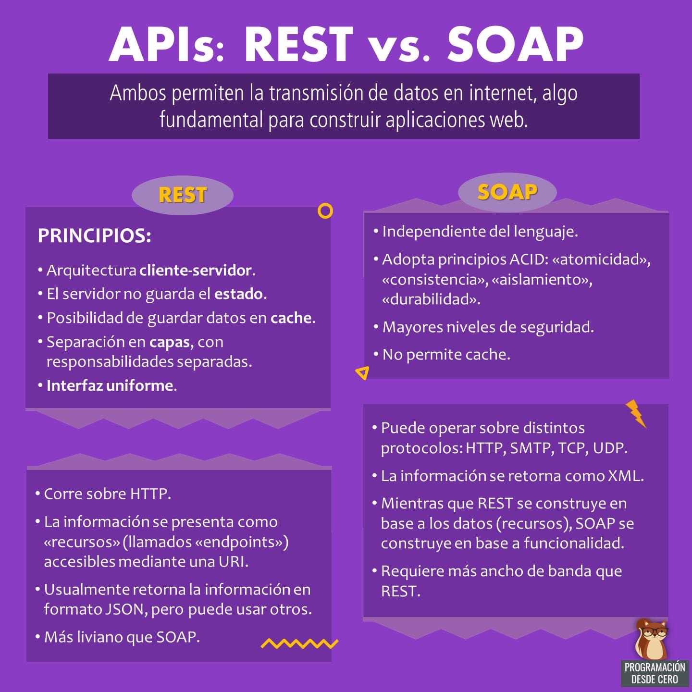
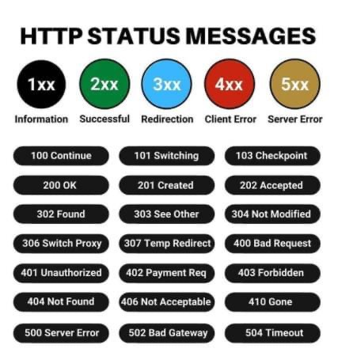
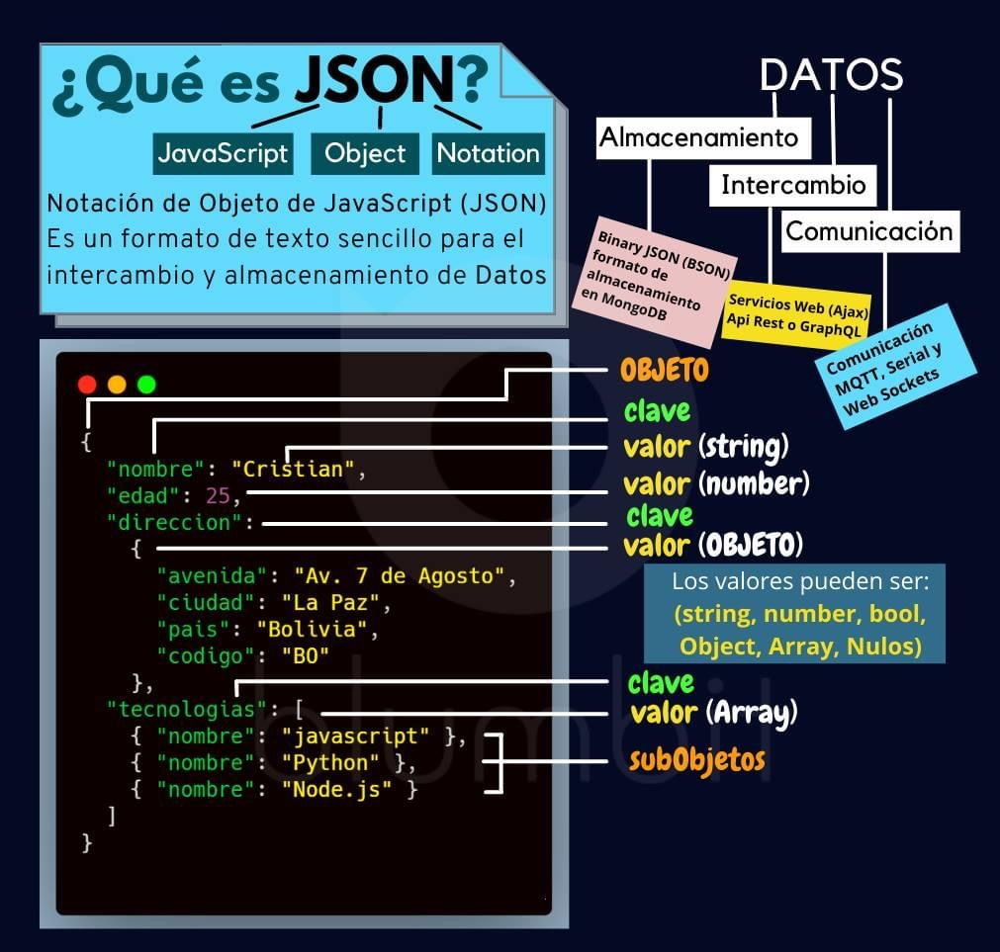
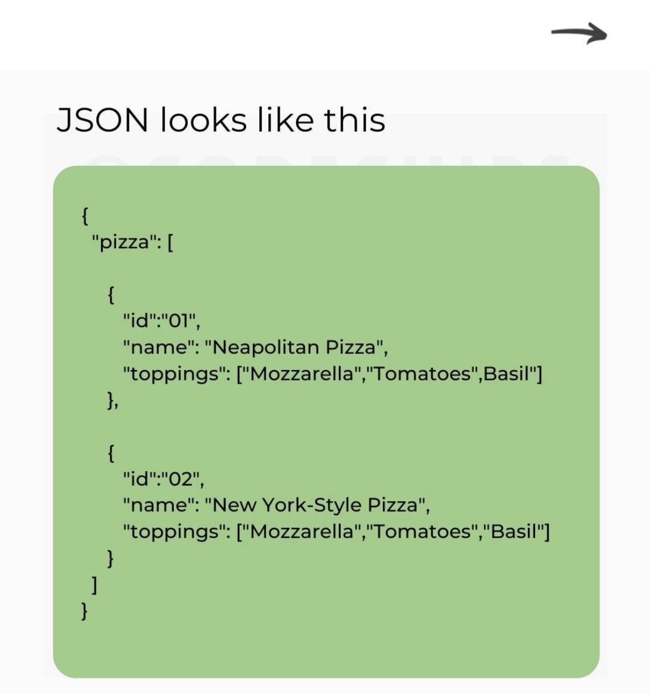
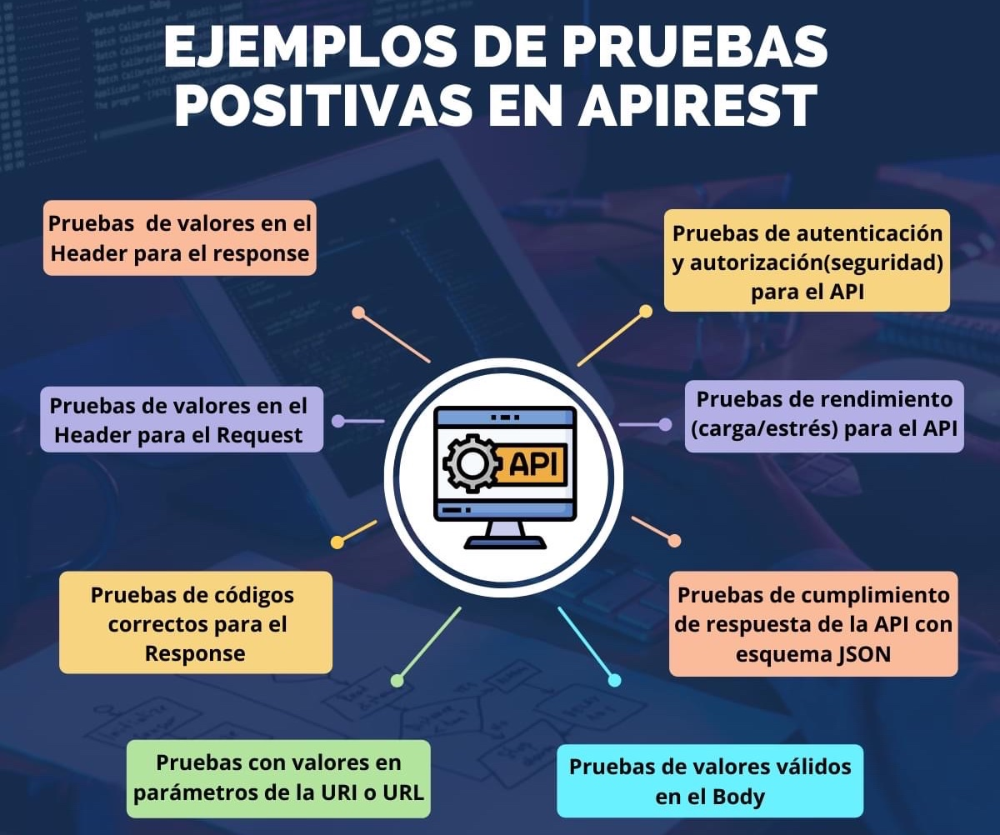
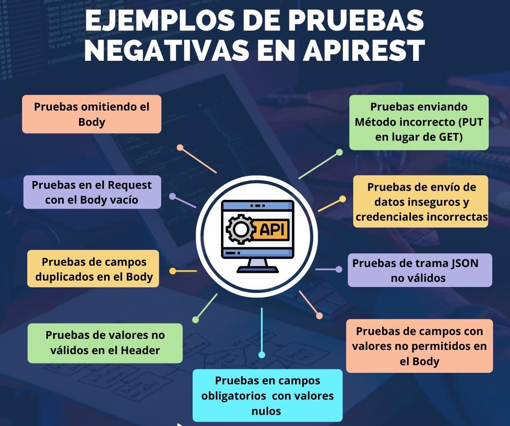

# API REST Testing

* Los Testers usan las API de un SUT, a través de una herramienta para su manipulación (ej. Postman), con el fin de validar las "RESPUESTAS" del Servicio Web de las "Solicitudes" a nivel de "INTEGRACIÓN" (Caja Blanca), entre la UI y el Backend (nuestra DB u otras DB de otros SUT). Esto es posible gracias a unos llamados (cuyo lenguaje código pueden ser JSON o XML u otros).

## Terminología

* Webservice (Servicio Web):
  * Es la Arquitectura en la Web regida por reglas HTTP. Las API son las ACCIONES de esa Arquitectura.
  * Es un medio estandarizado para propagar la comunicación entre el cliente y el servidor en la web.
  * Aplicaciones creadas en varios lenguajes de programación tengan la capacidad de comunicarse entre sí.
  * Protocolos de servicios web:
    * SOAP (Simple Object Access Protocol): Protocolo de Acceso de Objeto Simple. Diseñado antes de REST. Garantizar que los programas creados en diferentes plataformas y lenguajes de programación pudieran intercambiar datos de una manera sencilla pero lenta. Se basa en la transferencia de datos XML. Sólo método POST.
    * WSDL: Lenguaje de Definición de Web Service. Usado en SOAP. Es un XML que le dice a la aplicación lo que hace el WS (información para conectarse al WS y métodos que expone)
    * REST (REpresentational State Transfer): Es una arquitectura liviana, rápida, fácil de mantener y escalable. Es una forma de acceder a recursos (doc, imagenes, videos) que se encuentran en un entorno particular.Verbos de solicitud (métodos HTTP o CRUD): GET, POST, PUT/PATCH, DELETE
  * Funcionamiento:
    1. Request desde el Cliente al Server
    1. Response desde el Server al Cliente

* HTTP (HyperText Transfer Protocol):
  * Son las reglas y normativas del Servicio Web.
  * Es la policia Web entre el cliente-servidor. API es es transeúnte.
  * HTTP tienen status code (códigos de estados) -> (2XX, 3XX, 4XX, 5XX)

  

* API (Application Programming Interface):
  * Es la acción de integración REQUEST (Solicitud a la Web)- RESPONSE (la respuesta).
  * Conjunto de consultas (preguntas), comandos (ejecuciones) y eventos.
  * Permite que 2 aplicaciones interactuen entre sí, sin la intervención del usuario.
  * Código que ayuda a 2 software distintos a comunicarse e intercambiar datos entre sí.

* Endpoint: es la "habitación" del sistema. Guardan recursos.

* URL (Uniform Resource Locator): es la llave para abrir la puerta de la "habitación". Es el localizador del recurso
* URI (Uniform Resource Identification): es el identificador del recurso.
* URN (Uniform Resource Name): es el nombre del recurso.

* XML (eXtensible Markup Language): es un lenguaje de marcado extensible.
* JSON (JavaScript Object Notation): es un lenguaje de mensajeria (de datos). Formato de mensajes de API.

## Ejemplos de pruebas

