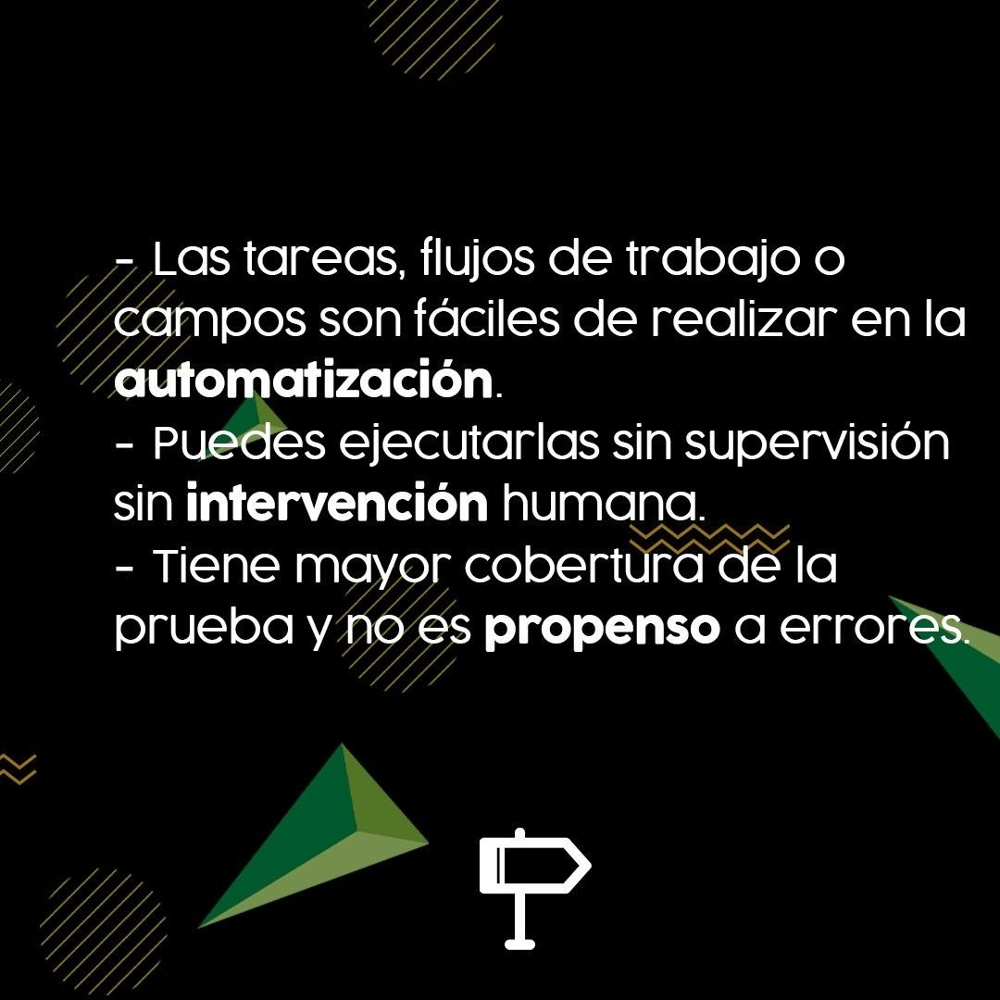
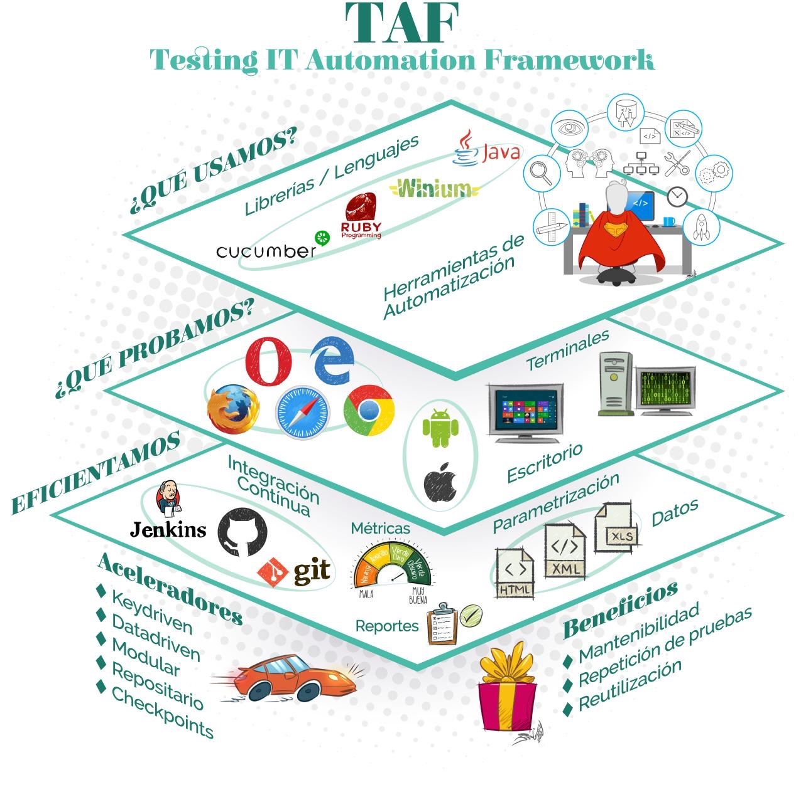

# Automatización de pruebas

## ¿Qué significa **automatización**?

## ¿Para qué hacer pruebas de automatización?

## ¿Conoces los **objetivos** principales de la **automatización**?

## ¿Sabes cuales son los principios esenciales de la **automatización de pruebas**?

## ¿Conoces la **pirámide** de **automatización** de pruebas?

## ¿De quién es la responsabilidad de automatizar en un equipo?

## ¿Cómo comenzamos una **estrategia de automatización**?

## ¿Cuáles son las preguntas que debemos hacernos antes de decidir que casos de prueba automatizar?

## ¿Cuáles son los skills?

## Framework de automatización

## ¿Cual es el proceso de automatización de pruebas?

## ¿Qué recomendaciones son necesarias para automatizar las pruebas?

## ¿Cuáles son las fases lógicas de una prueba automatizada?

## Punto de vista **Usuario** vs **Ingeniero de Automatización**

## Java for Testing

## Código **ejemplo** de Tests Automatizados

## ¿Qué son los **patrones de automatización** y cuáles son?

### ¿Qué es POM?

### ¿Qué es Screenplay?

