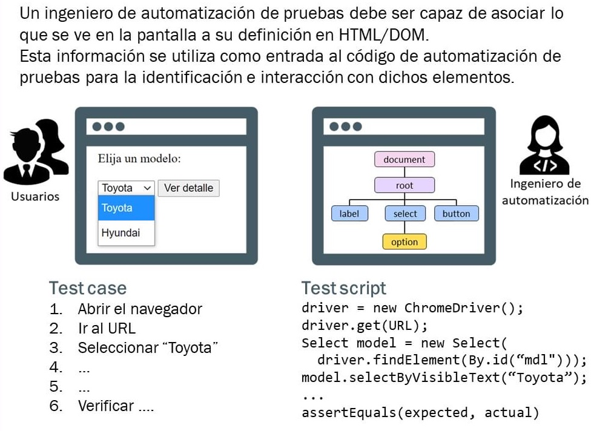

# Automatización de pruebas

## ¿Qué significa **automatización**?

* Automatizar pruebas es el proceso de armar un sistema que haga las pruebas del SUT
* Es programar (scripts)
* Es el uso de software construido especialmente para controlar la ejecución de pruebas y comparar el resultado obtenido con el esperado de un sistema o aplicación.

## ¿Qué **no es la automatización**?

* La solución a todos los males
* El sustituto de las pruebas manuales
* El futuro del testing
* Algo que se puede hacer independientemente de los equipos de desarrollo

## ¿Para qué hacer pruebas de automatización?

* Evitar tareas repetitivas (aburren al QA).
* Pruebas largas -> llaman al error
* Realizar pruebas adicionales difíciles o costosas de hacer manualmente.
* Pruebas de alto riesgo (aquello que sea más crítico y con mayor frecuencia de cambios)
* Requiere un proceso formalizado ya existente.
* Reducción de errores.
* Incrementar la cantidad de tests a realizar.
* Es crítica para CI/CD.
* Reduce costos: ahorro de tiempo de pruebas (+ rápido el robot) y menos recursos.
* Darle a los QA que no se dedican a automation, tareas que aporten mas valor (pensar escenarios nuevos y conocer más el negocio)

## ¿Automatizar tiene un costo?

* No es una solución gratuita y no tiene un ROI inmediato, por lo que pensar en "automatizar todo" en la gran mayoría de los proyectos es un sin sentido.
* Inversión en herramientas.
* Esfuerzo en el desarrollo de scripts.
* Se tiene que tener en cuenta el:
  * **COSTO** (dificultad de la feature a nivel técnico): [1..5],
  * **VALOR** (tamaño de la feature, dependencias): [1..5],
  * **RIESGO** (impacto para el negocio, probabilidad de ser visto o usado) [1..5].
  * si la suma de los 3 es mayor o igual a 9 se debería AUTOMATIZAR y poner a REGRESION

## ¿Conoces los **objetivos** principales de la **automatización**?

## ¿Sabes cuales son los principios esenciales de la **automatización de pruebas**?

## ¿Qué tests podemos automatizar?

* Pruebas unitarias
* Pruebas de integración
* Punta a punta
* Pruebas de regresión
* Stress
* Aplicaciones web / mobile
* APIs
* PL/SQL
* Sistemas completos

## ¿Conoces la **pirámide** de **automatización** de pruebas?

* **UAT (User Acceptance Testing)**:
  * Pruebas que se hacen viendo la pantalla.
  * Las realiza el cliente junto con BA (Business Analyst) / PO (Product Owner).
* **UI (User Interface)** (x100):
  * Pruebas en el frontend.
  * Difíciles de mantener y más frágiles.
  * Las realiza el QA Team / TAE
* **Service/Integration** (x1000):
  * APIs traen información. Prueba si la BD funciona bien.
  * Las realiza el QA Team / TAE / DEV
  * Verificar que 2 componentes funcionen bien juntos, convivan de manera efectiva
  * Requieren mocks (simulación de módulos)
* **Unit test** (x10000):
  * Pruebas en el backend.
  * Las hace DEV porque sabe su código. Algunas veces TAE.
  * Es la validación de un código o módulo
  * Java (JUnit), Python (unittest, pytest), JS (Jazmine)
  
* Arriba: ejecución lenta y mas costosas
* Abajo: ejecución rápida y menos costosas
* Un SW debe ser probado en diferentes niveles (de la base hasta el tope)
* Entre más arriba, el número de pruebas se reduce.
* Se trata de prevenir defectos, NO en buscarlos.
* Detección temprana: + rápido de corregir (+ barato)

## ¿De quién es la responsabilidad de automatizar en un equipo?

## ¿Quiénes pueden automatizar?

* Analistas
* Diseñadores
* Desarrolladores
* Tester
* Líderes de proyecto

## ¿Cómo comenzamos una **estrategia de automatización**?

## ¿Cuáles son las preguntas que debemos hacernos antes de decidir que casos de prueba automatizar?

## ¿Cuáles son los skills?

## Framework de automatización

## ¿Cuáles son las decisiones a tomar en el framework de automatización de pruebas?

* Procesos maduros/estables ?
* Tipo de sistemas a automatizar (web, cliente-servidor, mobile, API)
* Herramientas (ej. Selenium)
* Lenguaje de programación (Java, C++, Python)
* Arquitectura
* Datos (Excel, BD, yaml)

## ¿Cuáles son las facilidades que tiene que brindar un framework de automatización?

* Crear driver (abrir el navegador y dejar disponible para interactuar con la página)
* Manejo de esperas
* Screenshots
* Acceso a bas de datos
* Solicitudes a Api's
* Concurrencia en las ejecuciones
* Reintento en caso de fallas
* Reportes
* Cross browsing

## ¿Cuál es el ciclo de vida de la automatización (ATLC)?

* Decidimos automatizar
* Selección de herramienta
* Introducimos algunas pruebas
* Planificación de pruebas, diseño y desarrollo
* Ejecución y gestión
* Revisamos resultados y evaluamos

## ¿Cual es el proceso de automatización de pruebas?

## Metodología de QA Automation

1. Definir casos
1. Explorar opciones
1. Prototipar
1. Testear stress
1. Integrar a un pipeline
1. Volver a punto 1.

## ¿Qué recomendaciones son necesarias para automatizar las pruebas?

## ¿Cuáles son las fases lógicas de una prueba automatizada?

## Punto de vista **Usuario** vs **Ingeniero de Automatización**

## Java for Testing

## Código **ejemplo** de Tests Automatizados

## ¿Qué son los **patrones de automatización** y cuáles son?

### ¿Qué es POM?

* Es un patrón de diseño que mejora el mantenimiento, reduciendo duplicidad de códigos y manteniendo una estructura de proyecto adecuada y ordenada con localizadores independientes.
* Sin estructura POM: en la misma clase WebElements + métodos + tests
* Con estructura POM: una clase Page con WebElements + métodos y una clase Test con los tests que usan los pages.
* Los TESTS (asserts) conocen los STEPS (acciones de una página, ejemplo: clic, send_keys, etc.) y estos últimos conocen las PAGES (localizadores + métodos get que devuelven objetos WebElements).

### ¿Qué es Screenplay?

