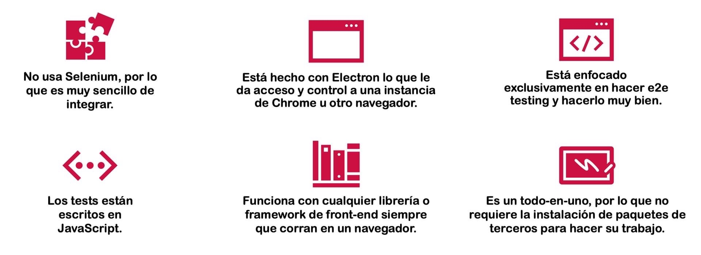
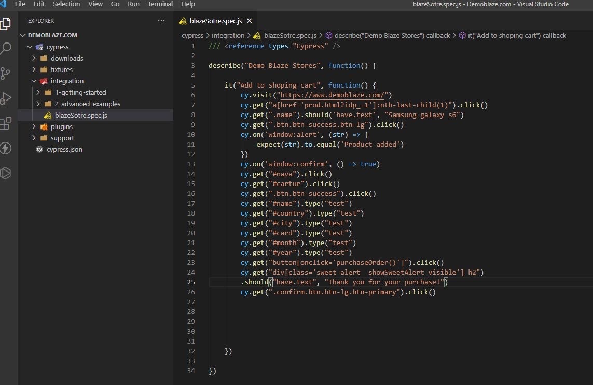
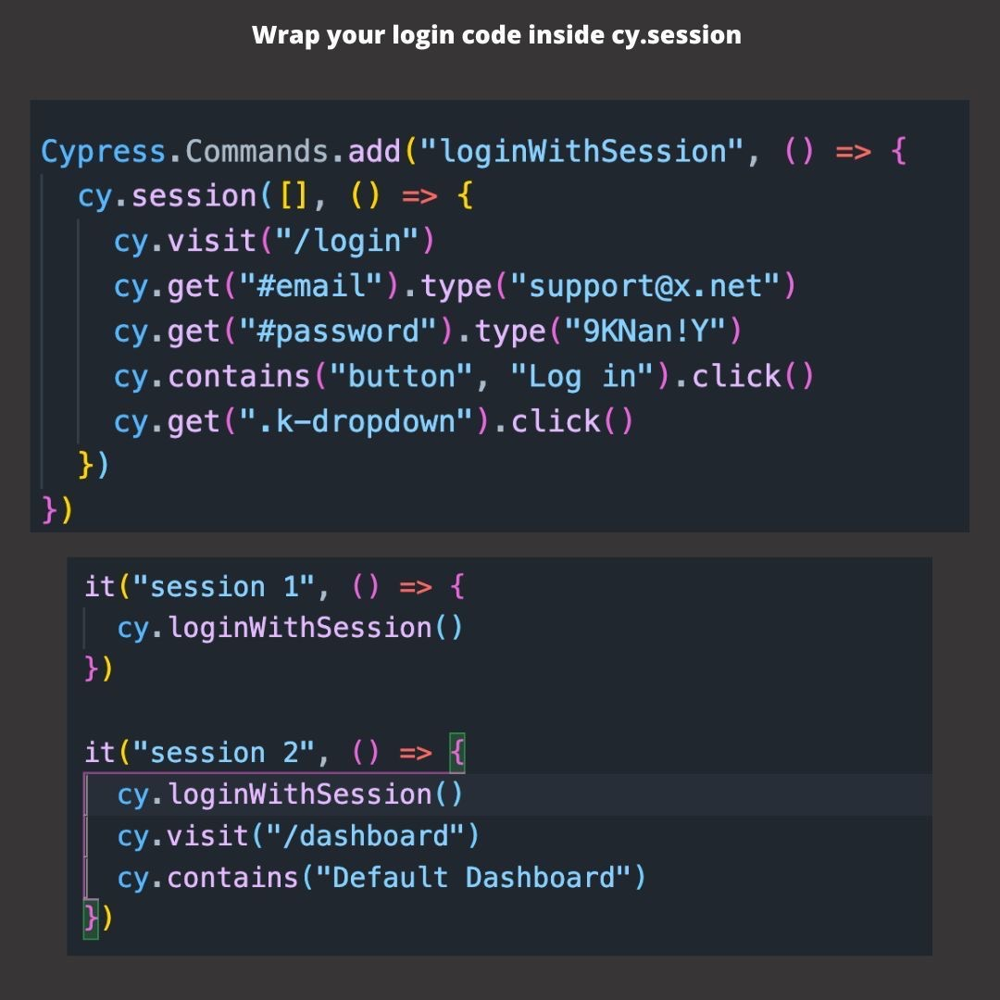

# Cypress

## Definición

* Es una herramienta realizada en JS para el testeo E2E donde las pruebas se escriben en JS.
* Diseñado para pruebas unitarias, de integración y E2E.
* Es un framework que permite hacerse pasar por un usuario real, controlando Chrome o Firefox, para navegar la página y comprobar que todo funciona correctamente.
* Se ejecuta en el mismo proceso que el browser.
* Utiliza Chrome, Firefox y Edge.
* "Pruebas rápidas, fáciles y confiables para cualquier cosa que se ejecute en un navegador".

## Características

* Time travel: Cypress toma instantáneas mientras se ejecutan las pruebas. Se puede ver cada uno de los pasos que esta haciendo el test.
* Debuggability: muy visual.
* Real time reloads: cada vez que se hacen cambios se van ejecutando los tests.
* Espera automática: Cypress espera automáticamente los comandos y assertions antes de continuar. Espera 4 segundos antes de agotar el tiempo para encontrar un elemento DOM. Cuando Cypress detecta un elemento page transition event, aumenta automáticamente el tiempo de espera a 60 segundos para el PAGE LOADevento único.

## Ventajas



## Instalación

1. Instalar Nodejs desde [link de Nodejs](https://nodejs.org/es/) o

    ```sh
    $sudo snap install node --classic
    ```

2. Setear las siguientes variables en el archivo de configuración de npm situado en /home/uxxxx/.npmrc con la siguiente información:

    ```plain
    proxy=http://wwwafip:80/
    https-proxy=http://wwwafip:80/
    http-proxy=http://wwwafip:80/
    strict-ssl=false
    @afip:registry=https://nexus.cloudint.afip.gob.ar/nexus/repository/npm-proxy/
    registry=https://registry.npmjs.org/
    noproxy="https://nexus.cloudint.afip.gob.ar/nexus/repository/npm-proxy/, nexus.cloudint.afip.gob.ar, .afip.gob.ar, https://nexus.cloudint.afip.gob.ar/nexus"
    always-auth=true
    ```

3. Descargarse desde [](https://www.afip.gob.ar/crts/root2.crt) el certificado correspondiente y generar una variable de entorno en el sistema operativo denominada node_extra_ca_certs donde el valor es la ruta donde se encuentra el archivo previamente descargado.
4. Agregar a .bashrc o .zshrc la siguiente línea: export NODE_EXTRA_CA_CERTS="/home/u45812/root2.crt"
5. Crear carpeta del proyecto.
6. Generar el archivo package.json para declarar las dependencias y configuraciones del proyecto:

    ```sh
    $npm init -y
    ```

7. Instalación de Cypress

    ```sh
    $npm i cypress
    ```

8. Abrir Cypress:

    ```sh
    $npx cypress open
    ```

## Archivo package.json

```plain
{
  "name": "prueba-cy",
  "version": "1.0.0",
  "description": "",
  "main": "index.js",
  "scripts": {
    "test": "echo \"Error: no test specified\" && exit 1"
    "cypress:open": "cypress open"
  },
  "keywords": [],
  "author": "",
  "license": "ISC"
}
```

* Luego, para ejecutar:

```sh
$npm run cypress:open
```

## Estructura de archivos

* Cypress recomienda utilizar la estructura estandar que posee y se auto-genera al instalar e inicializar por primera vez Cypress. La misma posee la siguiente estructura:

```plain
/cypress
  /fixtures
    - example.json
  /integration
    /examples
  /plugins
    - index.js
  /support
    - commands.js
    - index.js
```

## Estructura de test

* Cypress,a través de la libreria Mocha, determina una estructura básica para estructurar los tests.
  1. Crear un archivo *.cy.js en cypress/integration
  2. Generar un testsuite para todos los tests. Este marco se puede realizar utilizando context() o describe() (son sinónimos entre si, viene de Moka)
  3. Para cada test individual, nos ofrece la posibilidad de utilizar specify() o it() (son sinónimos entre sí, viene de Moka)
  4. expect viene de Chai



```js
/* global cy */
describe('Nombre del testsuite', () => {
    it('Nombre del test 1', () => {
        cy.visit('https://www.google.com.ar/')
        cy.contains('Gmail')
    })
    it('Nombre del test 2', () => {
        cy.visit('https://www.google.com.ar/')
        cy.get('input:first').type('QA automation')
        cy.contains('Buscar con Google').click()
    })    
})
```

## Selectores

```js
cy.get('input:first')
cy.get('input').first()
cy.get('[placeholder="un-placeholder"]')
cy.get('#es-un-id')
cy.get('.nombre-de-clase')  
```

## Plugins

1. eslint-plugin-cypress: Avisa de posibles errores estáticos.

```sh
$npm install eslint-plugin-cypress -D
```

## Hooks

* Cypress ofrece los siguientes hooks:

```js
before(() => {
  // runs once before all tests
})

beforeEach(() => {
  // runs before every test block
})

afterEach(() => {
  // runs after each test block
})

after(() => {
  // runs once all tests are done
})
```

## Only

* Para ejecutar solo los tests que necesito:

```js
...
it.only('login fails with wrong password', () -> {
    ...
})
...
```

## Assertions

[Assertions](https://docs.cypress.io/guides/references/assertions#Chai)

* Ejemplo:

```js
cy.get('.error').contains('Wrong credentials')

cy.get('.error').should('contain', 'Wrong credentials')

cy.get('.error')
  .should('contain', 'Wrong credentials')
  .should('have.css', 'border-style', 'solid')

expect({ name: 'Jane' }).to.eql({ name: 'Jane' })
```

## APIs

```js
cy.request('POST', 'http://localhost:3001/api/login', {
    username: 'ppando',
    password: 'ppando'
}).then(
    response => {
        
    }
)
```

## Fixtures

* Son archivos (key:value), utilizados en los tests a demanda.

### Formas de uso

* Utilizando el import, permitiendo importar el archivo a utilizar seteandole a una variable

```js
import user from '../fixtures/user.json'
```

* Utilizando el require. Funciona de la misma manera que import

```js
const user = require('../../fixture/user')
```

* Utilizando cy.fixture()

```js
describe("Titulo de test suit",function (){

    beforeEach(()=> {
        cy.fixture("afip").then(function(informacion){
            this.informacion=informacion
            })
    })
    
    it('Nombre del test', function ()  {
        cy.visit(this.informacion.url)
        cy.get(this.informacion.boton1).click()
        cy.get(this.informacion.boton2)
    })
})
```

## Comandos

* Cypress permite la generación de comandos personalizados. Pasos:
  1. En cypress/support/commands.js se pueden realizar todos los comandos personalizados que se desee para usarlos en todos los tests.

```js
Cypress.Commands.add('navegar', (url) => {
    cy.allure().step('Ingreso a la URL de AFIP')
    cy.visit(url)
})
```


