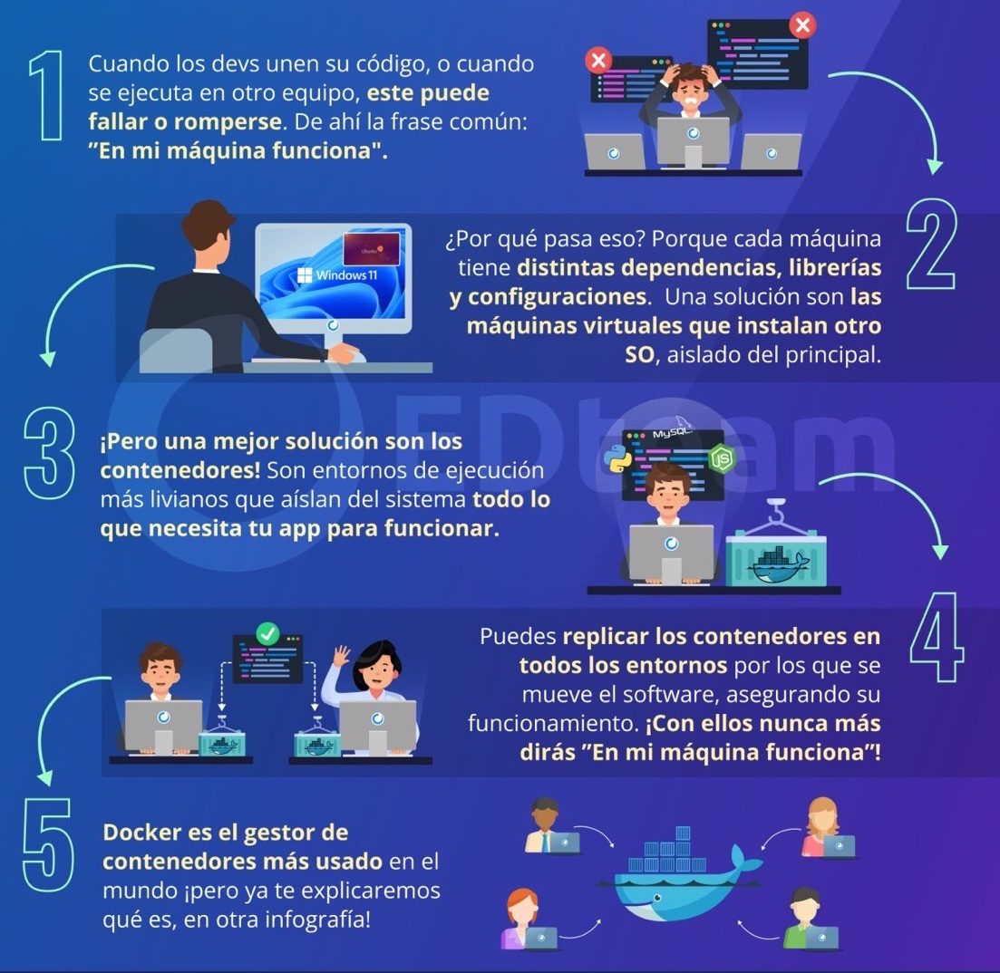
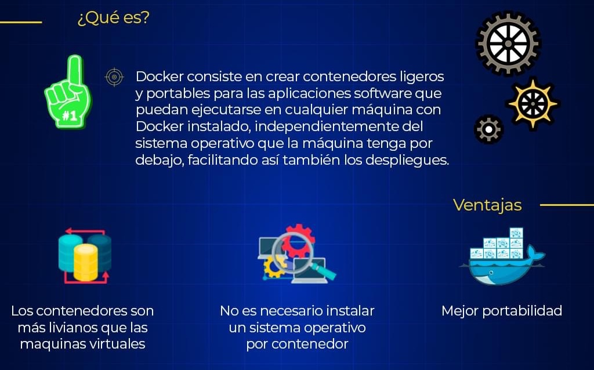
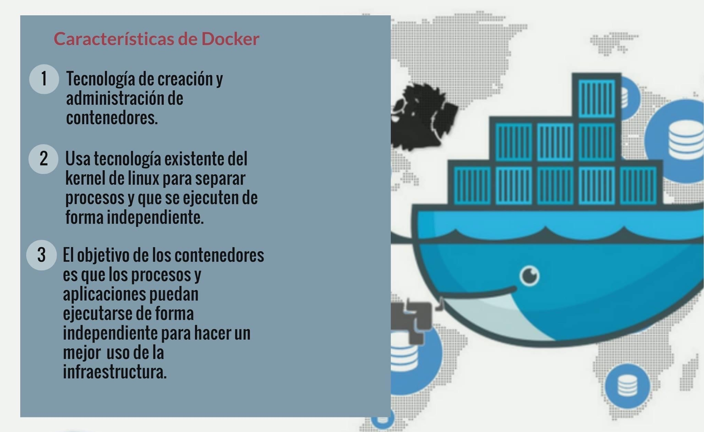
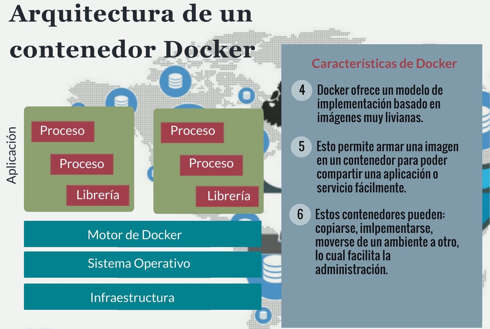
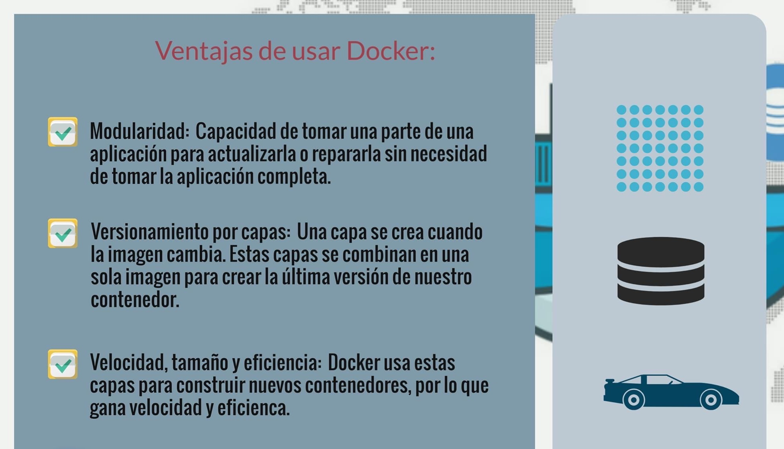
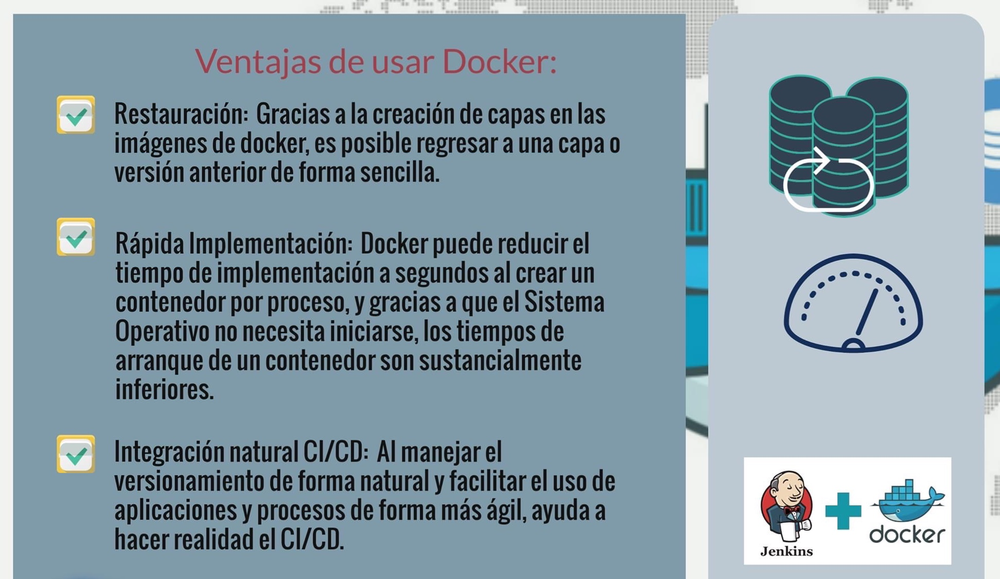
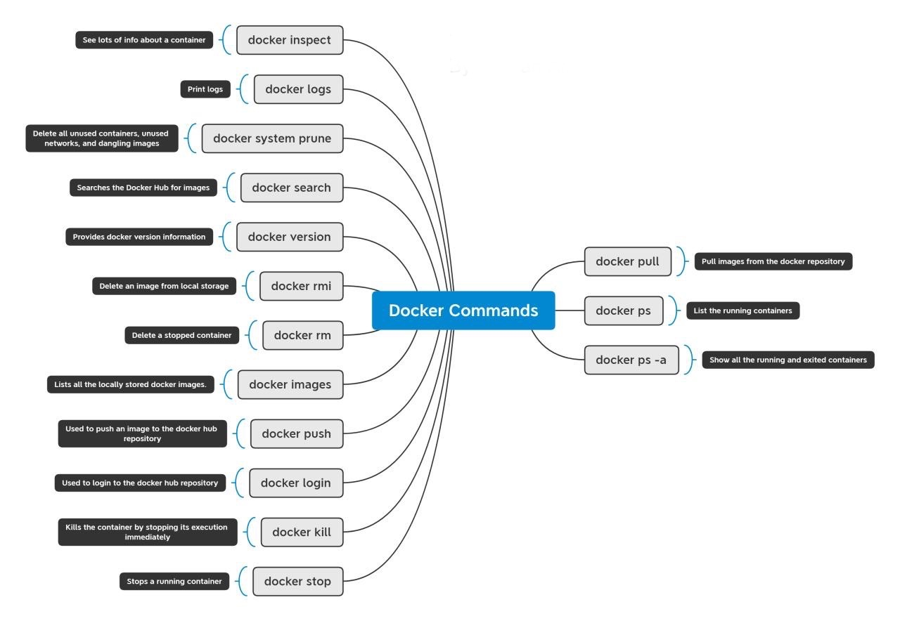
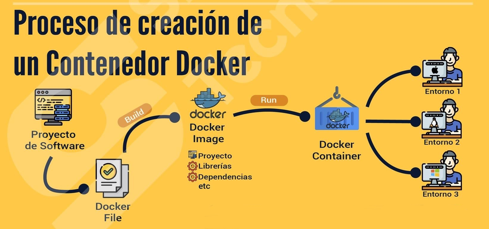
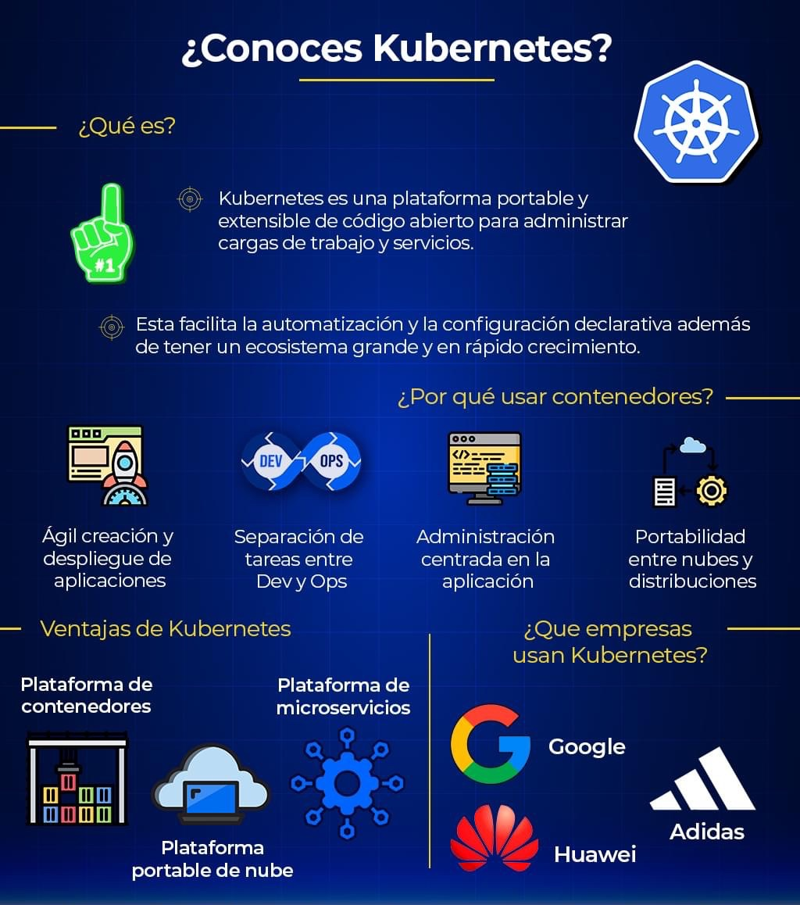

# Docker

## Contenedores de software

## Concepto de Docker

## Características de Docker

## Arquitectura de un contenedor Docker

## Ventajas de usar Docker

## Comandos de Docker

## Proceso de creación de un contenedor Docker

## Concepto de Kubernetes

## Estructura de un cluster de Kubernetes

