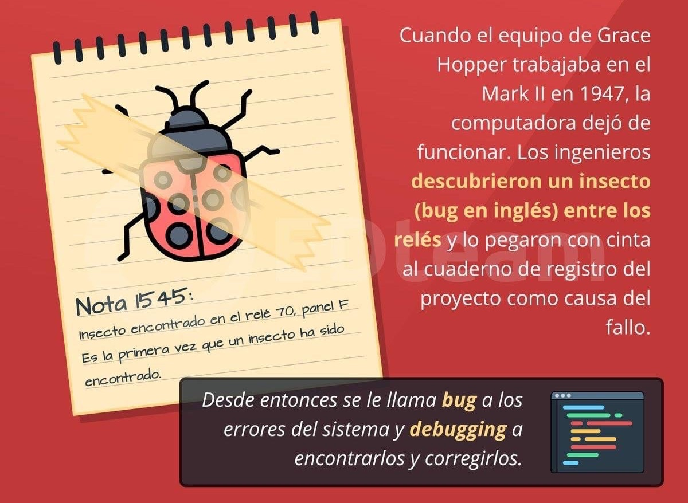
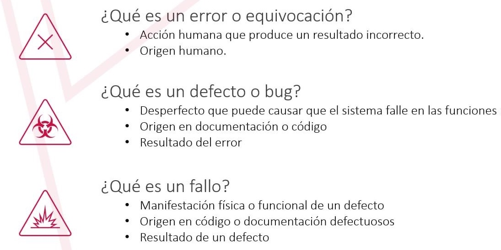
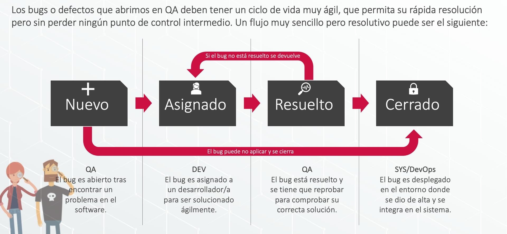
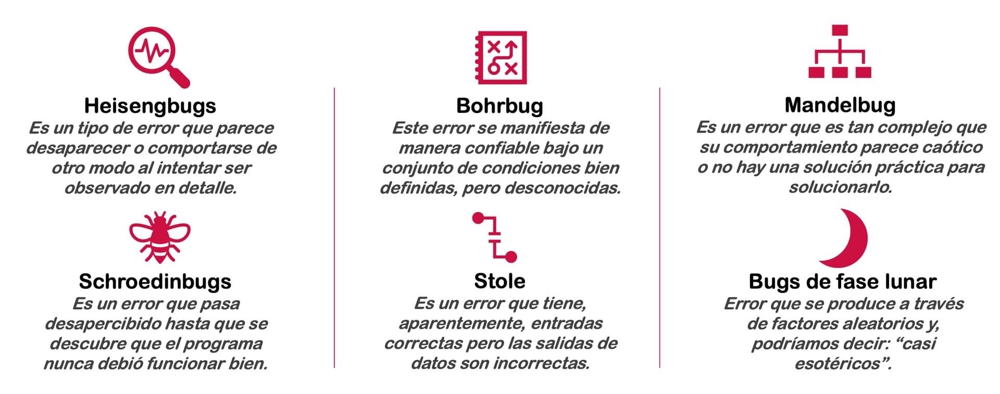
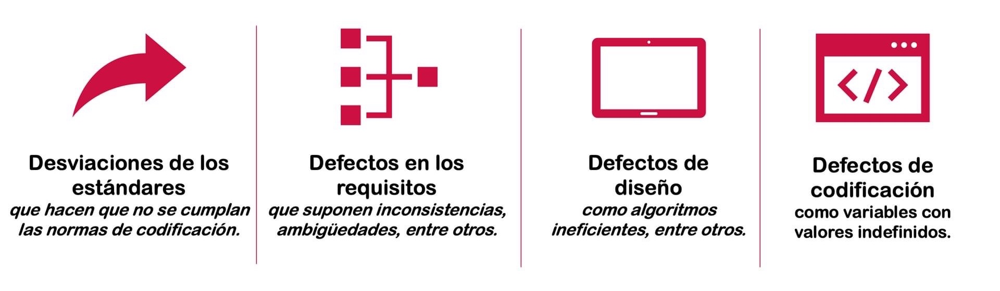

# Errores

## ¿Sabes qué es un bug?

## ¿Cuál es la diferencia entre **error, defecto y fallo**?

## ¿Cuál es el ciclo de vida de un **Bug**?

## ¿Conoces los **errores de software** inusuales?

## ¿Qué defectos típicos encontramos cuando realizamos **pruebas estáticas**?

