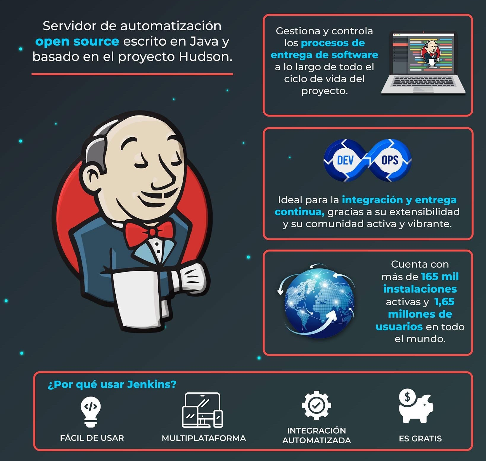
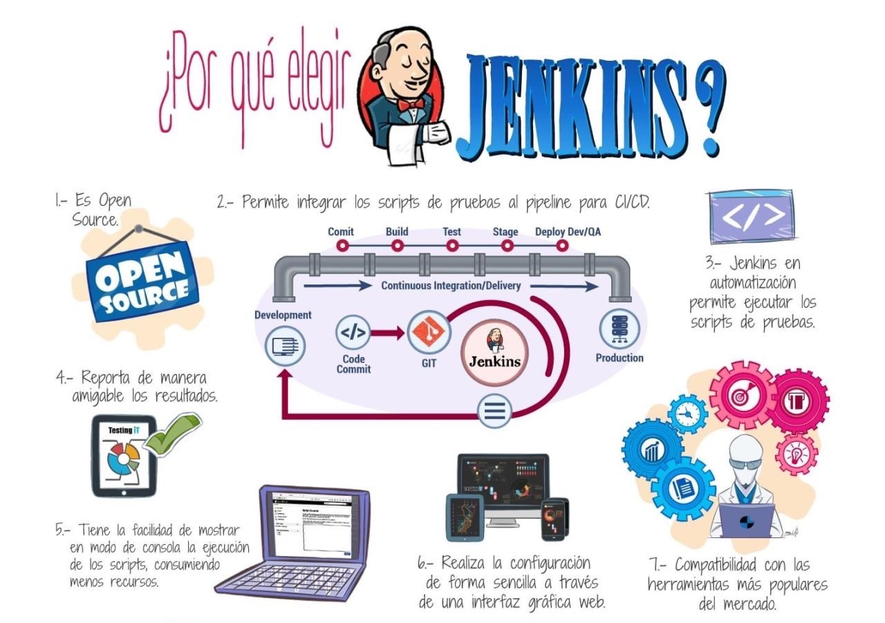

# Herramientas

* "Las herramientas no prueban. Solo las personas prueban. Las herramientas solo realizan acciones que **ayudan** a las personas a probar." James Bach

## Herramientas de automatización

* **Web UI**
  * Selenium
  * Cypress.io
  * Katalon Studio
  * Robot Framework

* **Mobile**
  * Appium
  * Espresso
  * Calabash
  * Testdroid
  * Kobiton
  * TestingBot
  * TestComplete

* **Performance**
  * Apache JMeter
  * Nightwatch.js
  * Locus

* **Web services**
  * Postman
  * SoapUI
  * REST-assured
  * Karate

* **Windows**
  * WinApp Driver
  * WindowTester

* **BDD**
  * Java: Cucumber, JBehave, Specflow
  * Python: Behave, Lettuce, Pytest Bdd, Radish
  * Javascript: CucumberJS

* **Otras**
  * UFT
  * Rational Functional Tester
  * Test Studio
  * Watir
  * Tricentis Tosca
  * TestPlant
  * TestProject
  * Protractor
  * Assertible
  * Apigee
  * Unified Functional Testing

## Frameworks para tests unitarios

## Frameworks para reportes

* TestNG Matrices Report
* Allure Dashboard
* Extent Report
* Reportportal.io

## Lenguajes de programación

* Java
* C#
* Python
* JavaScript

## Pirámide de Test Automation

## Selenium

## Jenkins

