# Introducción

## ¿Conoces las diferencia entre **verificación** y **validación**?

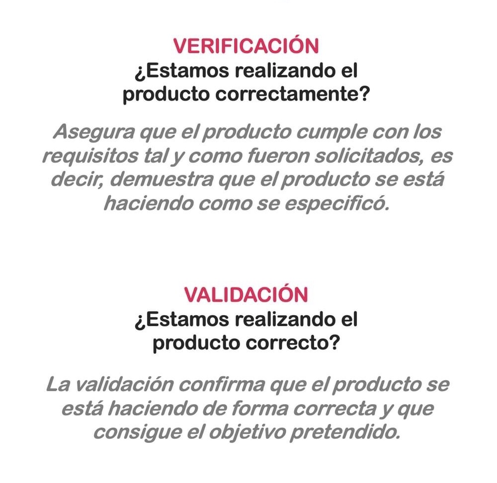

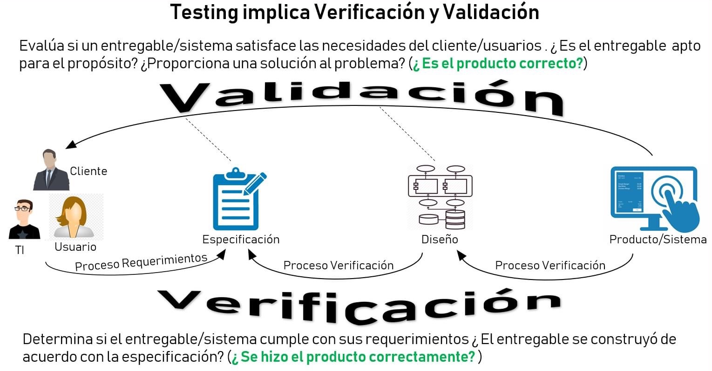

## ¿Cuál es la **diferencia** entre **Calidad** y **Testing**?

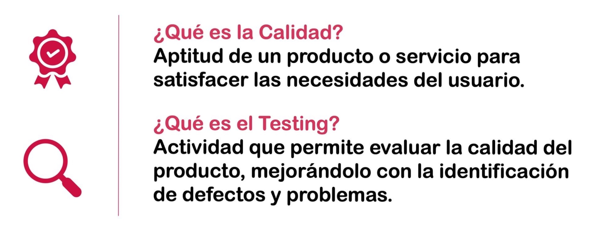

## ¿Qué son los **atributos** de calidad?

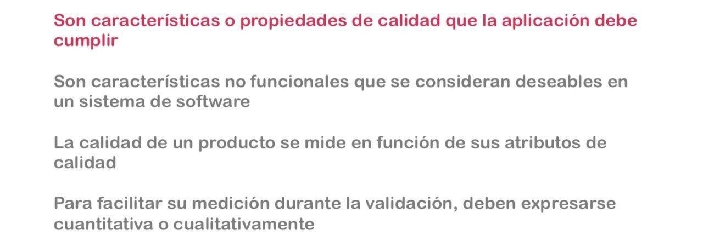

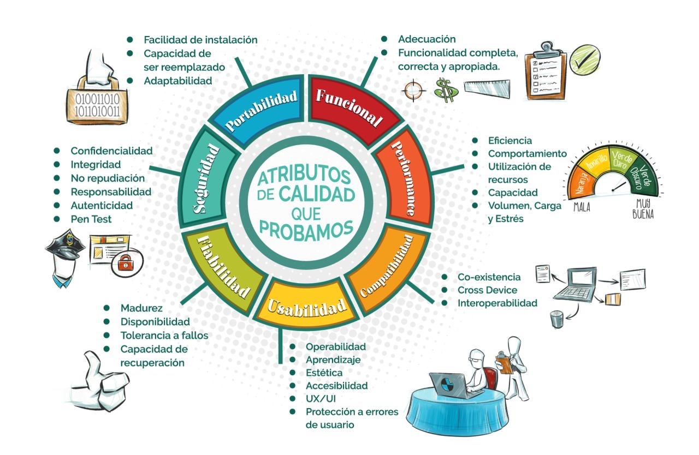

## ¿Sabes medir el **retorno de inversión** de **QA** en un proyecto?

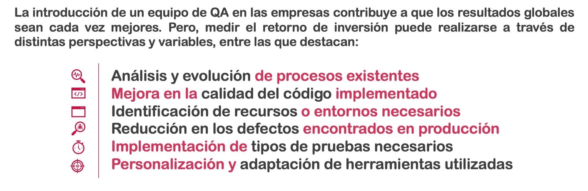

## ¿Qué **tareas** se hacen en **QA** y cuales en **Testing**?

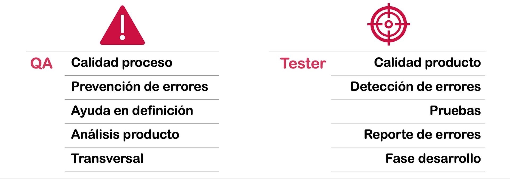

## ¿Qué **beneficios** nos aporta un proceso de **calidad de software**?

## ¿Qué aportan las **pruebas** en un producto de software?

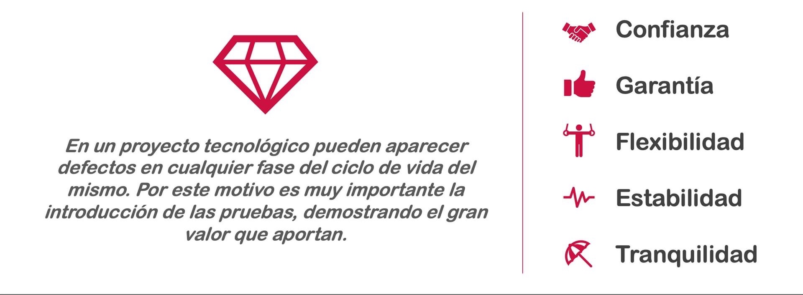

## ¿Conoces las **verdades absolutas** (principios) del Testing?

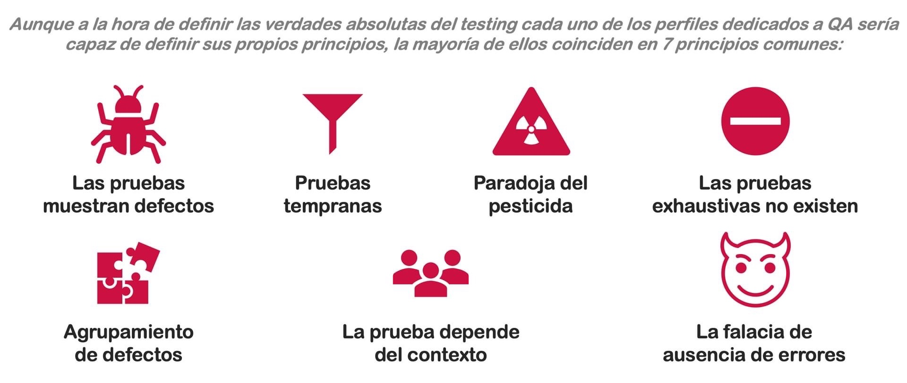

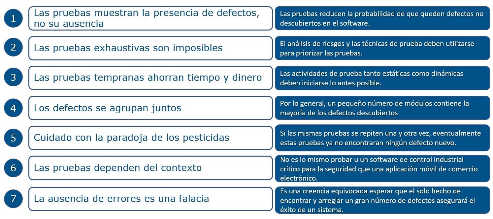

## ¿Qué dice la **paradoja del pesticida** sobre nuestras pruebas?

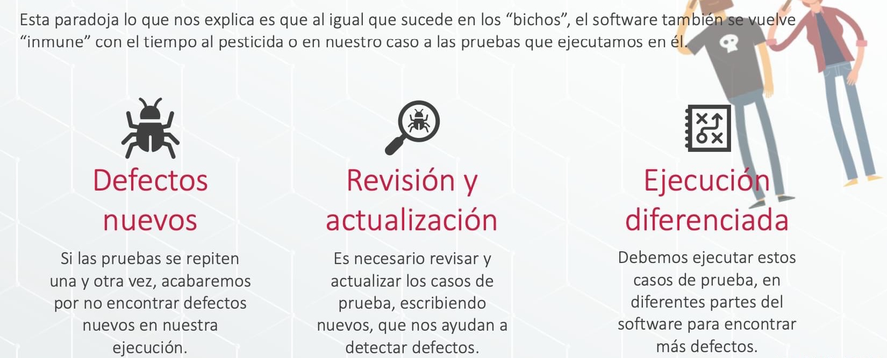

## ¿Conoces estas **curiosidades del Testing**?

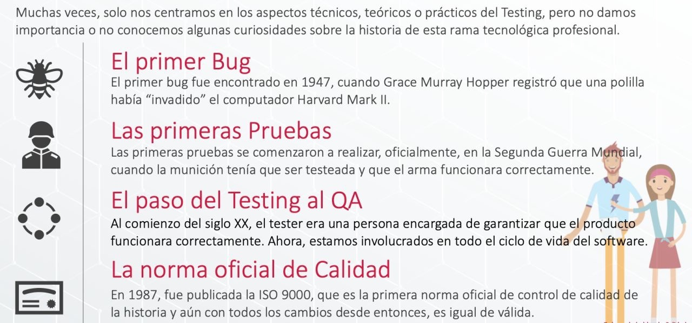

## ¿Conoces la **historia del Testing**?

