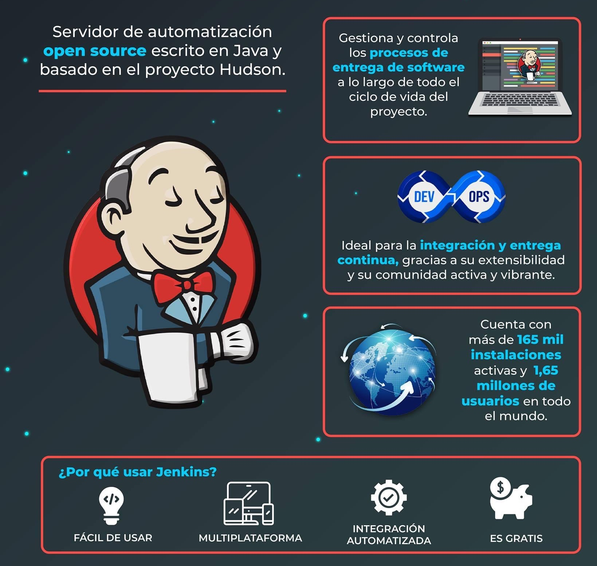
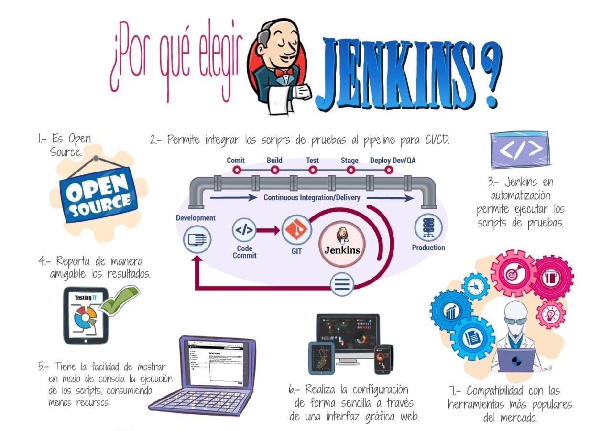

# Jenkins

## ¿Qué significa CI/CD?

* Conjunto de prácticas de desarrollo de software, con foco en ciclos de vida definidos por software, destacando el uso de herramientas que apuntan a la automatización de tareas.
* CI (integración continua):
  * Pruebas y construcción periódica del código: construir + testear + compilar
  * Los programadores suben su código a un repositorio central donde automáticamente pasan las pruebas, y así detectar fallos cuanto antes y así mantener el código siempre actualizado.
  * Por ejemplo, desde la rama de master podemos escribir una de serie de pruebas al hacer un pull o merge request. Si las pruebas se pasan hacemos que se suba y se despliegue automáticamente en producción.

* CD (Entrega Continua): Producto de software en repositorio común, listo para despliegue. Entrega automática a repositorio
* CD (despliegue continuo): Automatización completa desde el desarrollo hasta producción. Despliegue automático  

## ¿Qué es Jenkins?

* Servidor de automatización de código abierto, autocontenido, que puede ser usado para automatizar todo tipo de tareas relacionadas a:
  * la construcción,
  * pruebas,
  * entrega y
  * despliegue de software.
* Permite correr tareas, eventos, avisos





## Jenkins pipeline

* Construcción por pasos (procesos)
* CI -> CD -> Deploy Continuo
* Lenguaje groovy (jenkinsfile en el repositorio Git)

## Requisitos

* Código fuente en repositorio Git.
* El proyecto debe poder generar el entregable al descargarse y ejecutar los comandos estándares de construcción para cada herramienta.

## Instalación

```sh
$sudo apt-get install jmeter
```
