# JMeter

## ¿Qué son las pruebas de **rendimiento**?

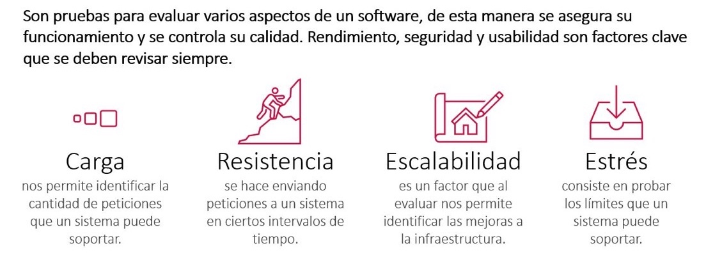

## ¿A qué nos ayudan las **pruebas de rendimiento**?

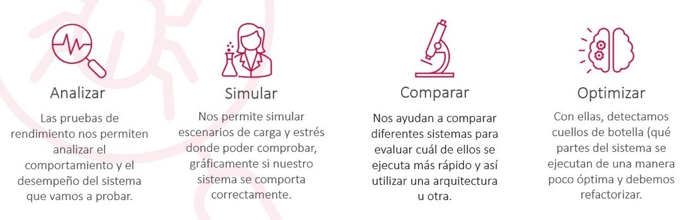

## Preguntas


## ¿Por qué es importante las **pruebas de performance**?

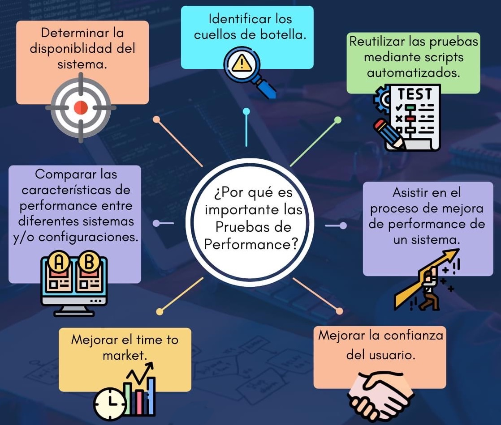

## ¿Cuáles son las razones para realizar pruebas de performance?

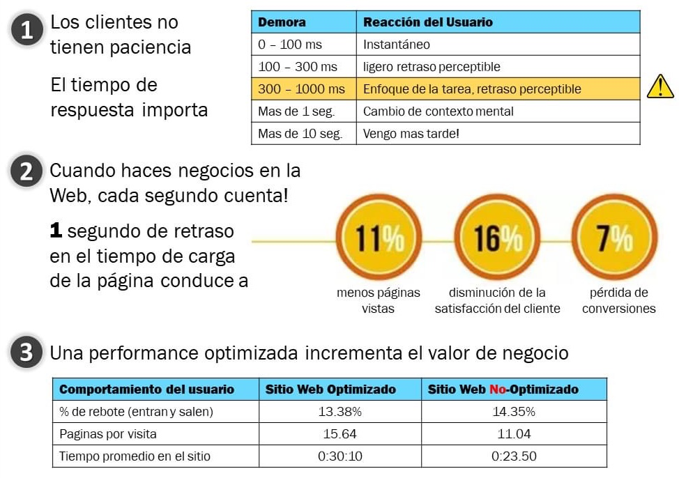

## ¿Por qué una aplicación es lenta?

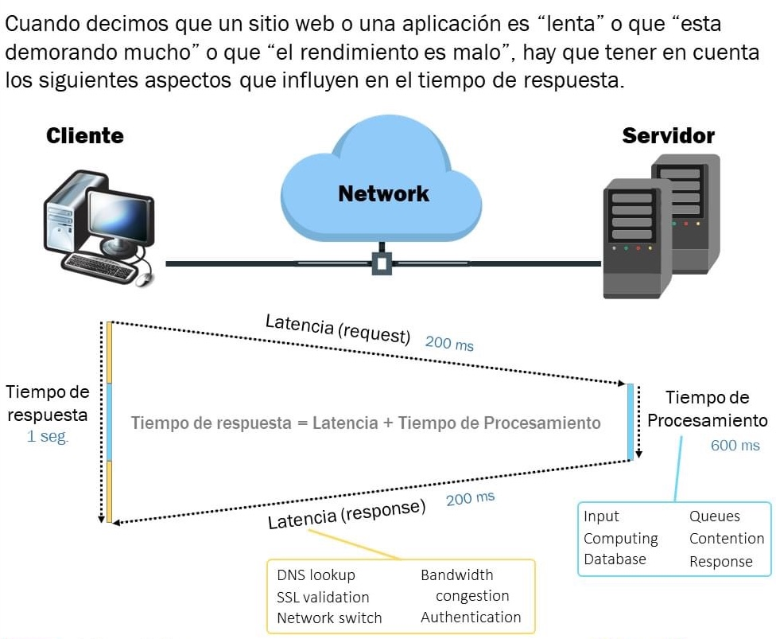

## Concurrencia de usuarios

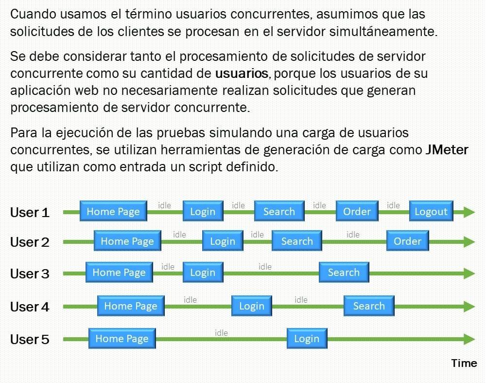

## ¿Cuáles son las herramientas para pruebas de rendimiento?

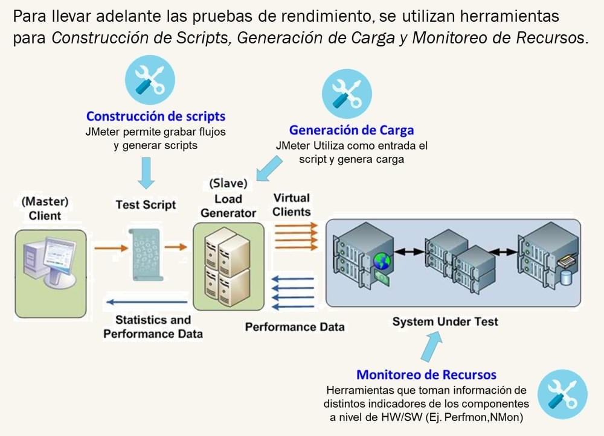

## ¿Cómo **nos ayuda JMeter** a realizar pruebas de rendimiento?

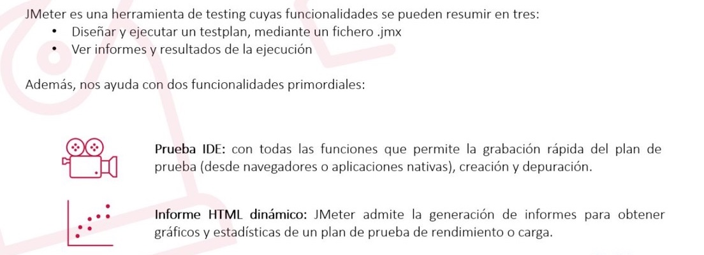

## ¿Cuáles son las características principales de JMeter?

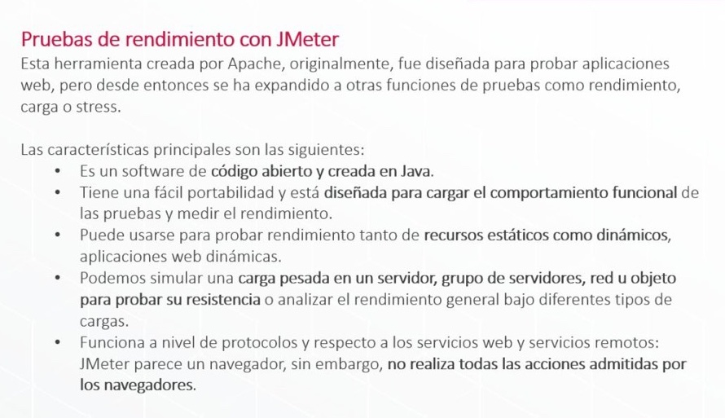

## ¿Cuáles son las razones para usar JMeter?

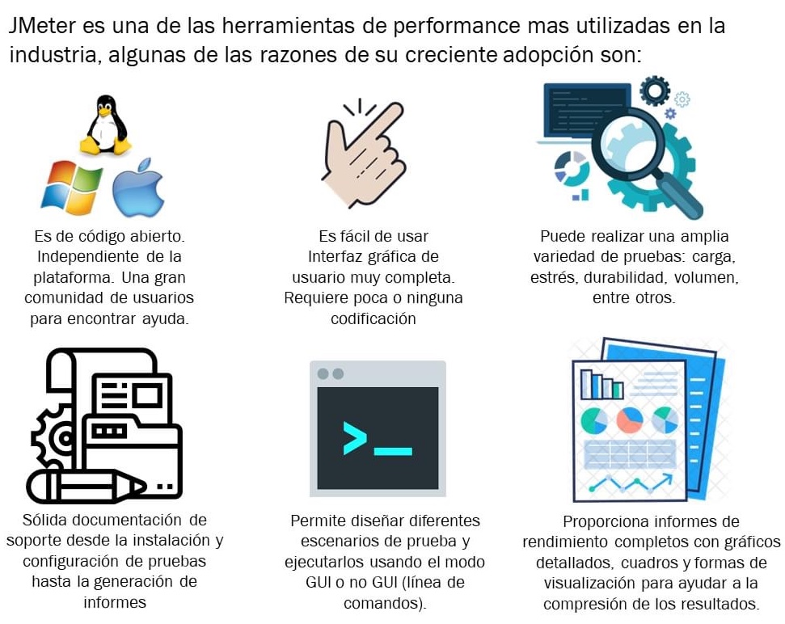

## Instalación

```sh
$sudo apt-get install jmeter
```

## Monitoreo de la aplicación

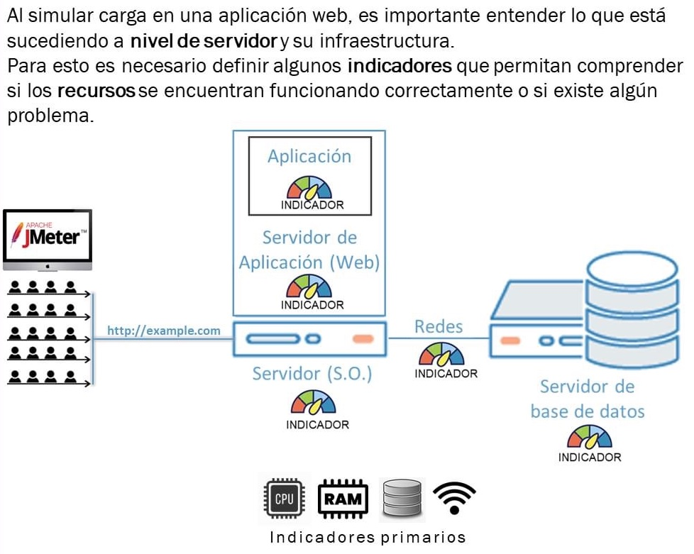

## Plan de pruebas de performance

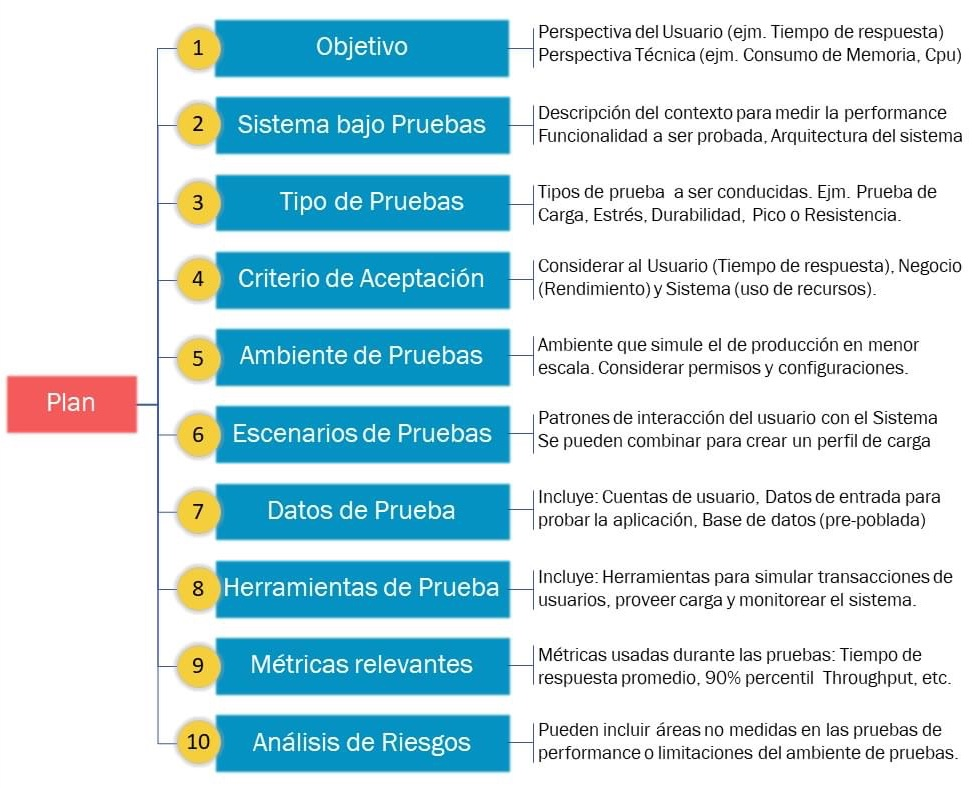

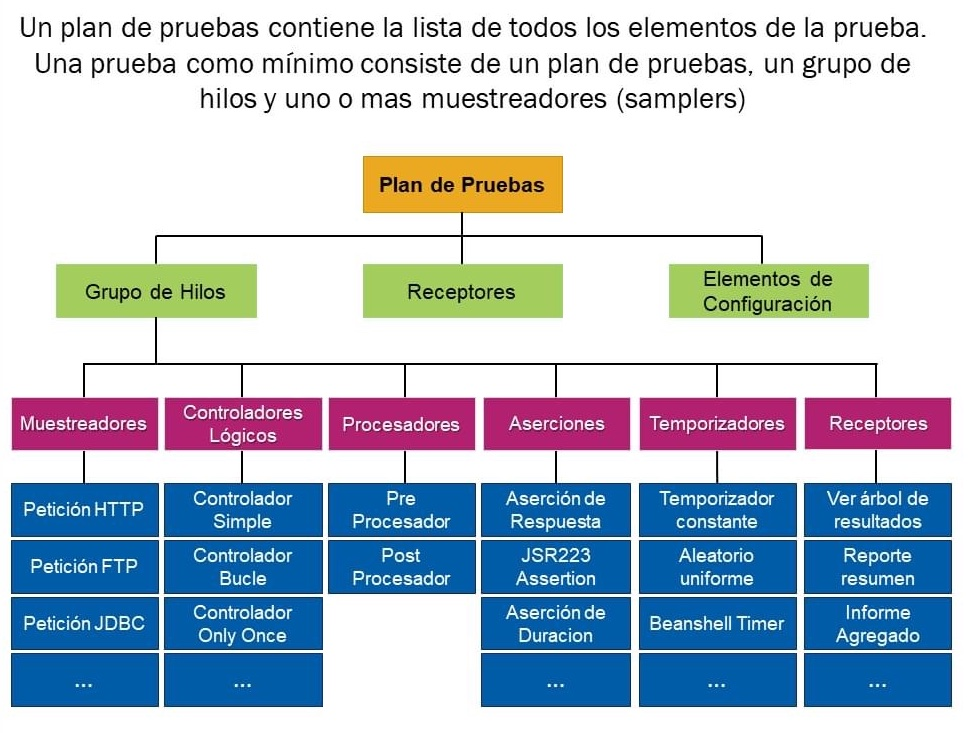

## ¿Cómo es el orden de ejecución?

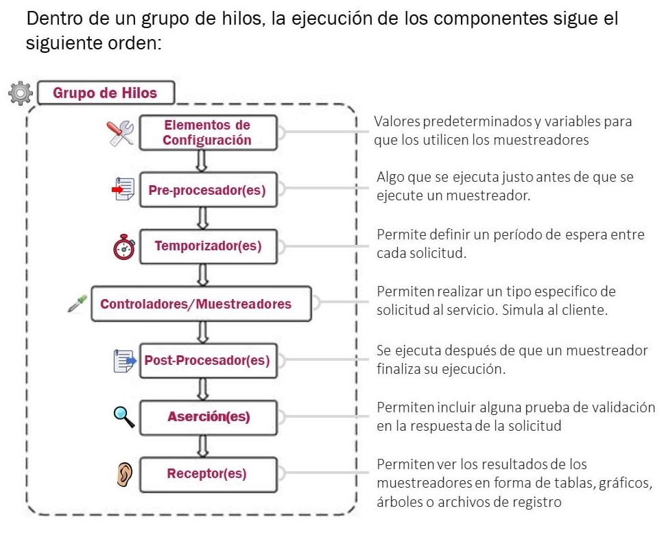

## ¿Qué son los receptores?

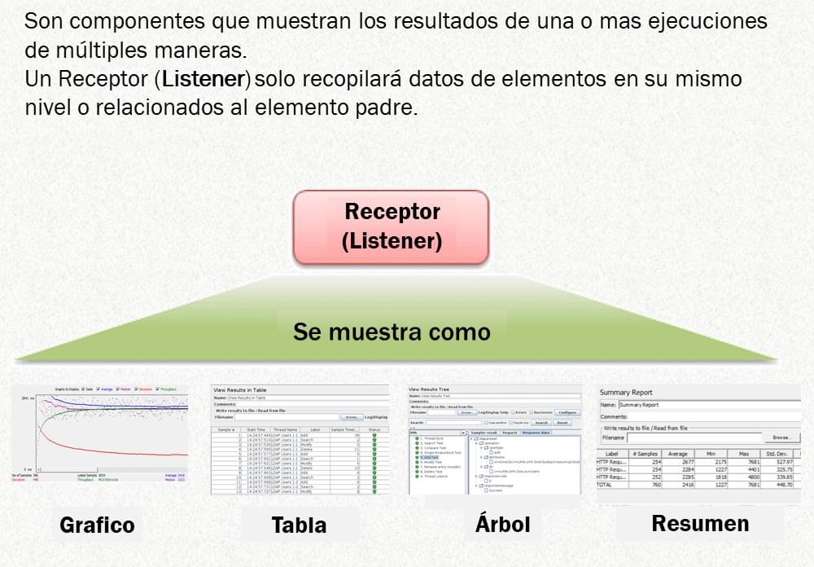