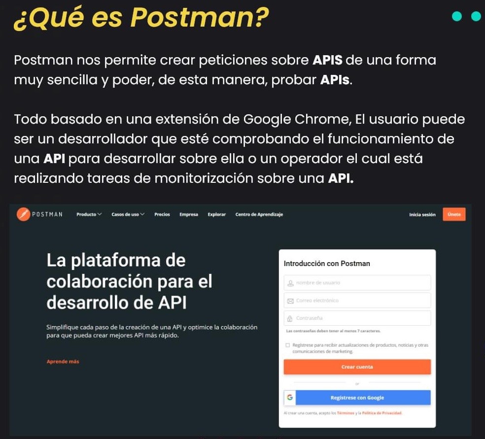
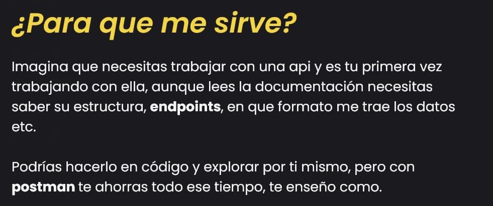
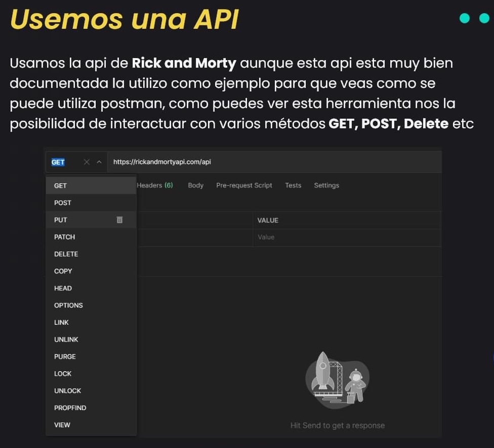
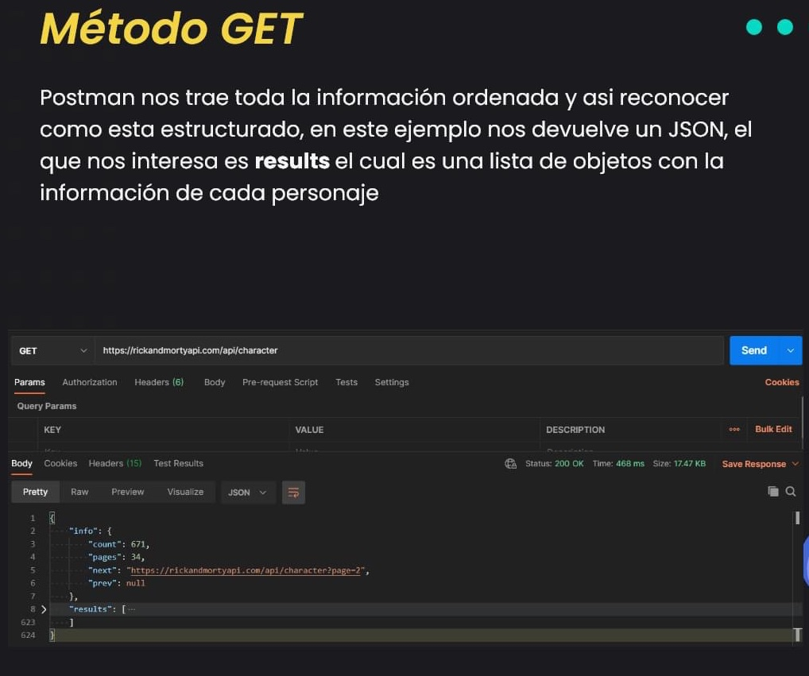

# Postman

* API: es el medio con el cual nos comunicamos con una aplicación y entre aplicaciones.
* Es una herramienta que simplifica cada paso del ciclo de vida de la API (por ejemplo, el testeo) y agiliza la colaboración para que puedas crear mejores APIs, más rápido.
* Permite crear y enviar peticiones HTTP a servicios REST mediante una interfaz gráfica. Estas peticiones pueden ser guardadas y reproducidas posteriormente.





## ¿Qué puedo testear en una API?

* Estructura json correcta
* Información json correcta
* Que el mensaje haya llegado (status code == 200)

## Instalación

```sh
$sudo snap install postman
```

## Componentes

* Environment: Se guardan valores en variables que se usan frecuentemente en un entorno. Usado para varias colecciones (ej. variables globales):
  * VARIABLE. Ej. key
  * INITIAL VALUE: Ej. MyKey
  * CURRENT VALUE: Ej. 1234567890

  * Ejemplo: GET https://{{environm}}/{{id}}

* Collections:
  * Es el lugar donde pongo los requests organizados o no en folders.
  * Equivale a Test Suite. Los foldes equivale a Test Case.
  * Ejemplo:
    * Test Suite
      * TC #1 | CRUD en una Card
        * GET  Obtener una Card
        * POST Crear una Card con nombre
        * PUT  Modificar el nombre y desc de una Card
        * DEL  Eliminar una Card



* Request:
  * Equivale a los Action Steps.
  * Compuesto por:
    * Nombre
    * Método {GET, POST, PUT ...} + URL
    * Params: KEY + VALUE + DESCRIPTION
    * Auth
    * Headers: KEY + VALUE + DESCRIPTION
    * Body: se usa cuando usamos un POST
    * Test Scripts (equivale a los Expected Results)



## Variables de scope

* Variables Globales (GLOVAR). Se usan para poner los endpoints.

* Variables de Ambiente (AMVAR). Se pueden tener varios ambientes. Sobreescribe COLVAR. cuando los nombres de variables son iguales.

* Variables de Colección (COLVAR). Sobreescribe GLOVAR

* Variables de Datos (DATAVAR). Sobreescribe AMVAR.

### Como se usan

* {{nombre_variable}}

## Estructura de la URL

* Endpoints. Constituidos por:
  * /: para separar directorios y endpoints
  * ?: para variables
  * =: key-value
  * &: para separar variables

* Estructura URL. Ejemplo https://upexsprint3.atlassian.net/jira/software/c/projects/UPEX/boards/9/backlog?quickFilter=13
  * Procolo: https://
  * Subdominio: upexsprint3
  * Dominio: atlassian
  * Extensión: net
  * Directorios: jira/software/c/projects/UPEX/boards/9/
  * Endpoint: backlog
  * Variables: quickFilter=13

## Authentication and Authorization

* Autenticación: es el usuario. Es la KEY.
* Autorización: es la contraseña. Es el TOKEN.

## Consola

* Tecla F12: Abre la Herramienta de Desarrollo (Dev Tools)
* Tab "Network" -> Fetch/XHR: muestra los llamados de APIs
  * Headers (encabezados): tiene la solicitud.
  * Payload (carga útil): los detalles del request
  * Preview (vista previa): los detalles del response  

## Params

* Path parameters:
  * Esta en la URL entre un endpoint y una variable.
  * Ejemplo1 URL: {{dom}}/{{cards}}/625cc9b53231ce?key={{key}}&token={{token}} , donde 625cc9b53231ce es el path parameters.
  * Ejemplo2 URL: {{dom}}/{{cards}}/:Id?key={{key}}&token={{token}} , donde Id es una variable de Path

* Query parameters:
  * Esta en la URL después del símbolo ?
  * Ejemplo URL: {{dom}}/{{cards}}?nombre=pablo&localidad=CABA

## Métodos HTTP

* GET (READ)
* POST (CREATE)
* PUT (UPDATE)
* DELETE (DELETE)

* Ver siempre la documentación de la API.

## Scripts de Pruebas

* Postman permite generar código JavaScript para cada request (precondición y postcondición)
* Se hacen en el Tab "Tests"
* Sintaxis test en Postman.

  ```javascript
  pm.test("Debería ser el resultado esperado", () => {

  });
  ```

* Ejemplo:

  ```javascript
  pm.collectionVariables.set('auth', pm.response.json().token)

  pm.test('Status 200', function() {
      pm.response.to.have.status(200)
  })
  ```

* Assertions: son las líneas de código para hacer las condiciones de la prueba.

  ```javascript
  pm.response.to.have.status(200);
  
  const body = pm.response.json();
  const actual = body.propiedad;

  pm.expect(actual).to.be.eql(esperado);

  pm.expect(body).to.be.an("object");

  pm.expect(actual).to.be.an("string").and.to.be.eql("un valor");

  pm.expect("b").to.be.oneOf(["a", "c", "b"]);

  pm.expect(["a", "c", "b"]).to.include("b");

  pm.expect(body).to.include({"a":1, "b":2})

  const b3 = body.find(i=>i.b===3)
  pm.expect(b3).to.include({"b":3})

  console.log(body);
  
  ```

## Scripts de variables de Scope

  ```javascript

  //Scope: Globals
  pm.globals.set("cont", 0)
  pm.globals.get("cont")
  pm.globals.unset("cont")

  //Scope: Collection
  pm.collectionVariables.set("id", pm.response.json().id)
  pm.collectionVariables.get("id")
  pm.collectionVariables.unset("id")

  //Req1 puede setear una variable (set) y Req2 puede leerla (get)
  //Es buena práctica, una vez que la variable no se usa, eliminarla!!!

  ```

## Pre-scripts. Generación de data random

* Pre-scripts: son las precondiciones. Es la preparación de data.
* En Tab "Pre-req."

  ```javascript
  //Generación random del nombre de un país
  const nuevo_nombre = pm.variables.replaceIn("{{$randomCountry}}")
  pm.environment.set("nombre", nuevo_nombre)
  ```

## Proceso

1. Crear la colección
1. Agregar folders y requests
1. Setear al request: método (GET/POST/PUT/DELETE) y URL del endpoint
1. Desarrollar tests
1. Clic en botón 'Enviar'
  1.1. Se ejecutan los pre-scripts, para generar data
  1.1. La data es usada en párametros.
  1.1. Con el parámetro se envia en el request
  1.1. Se ejecuta el request y genera el response
  1.1. Del response se puede obtener el body
  1.1. Se ejecutan los scripts que validan el body.
