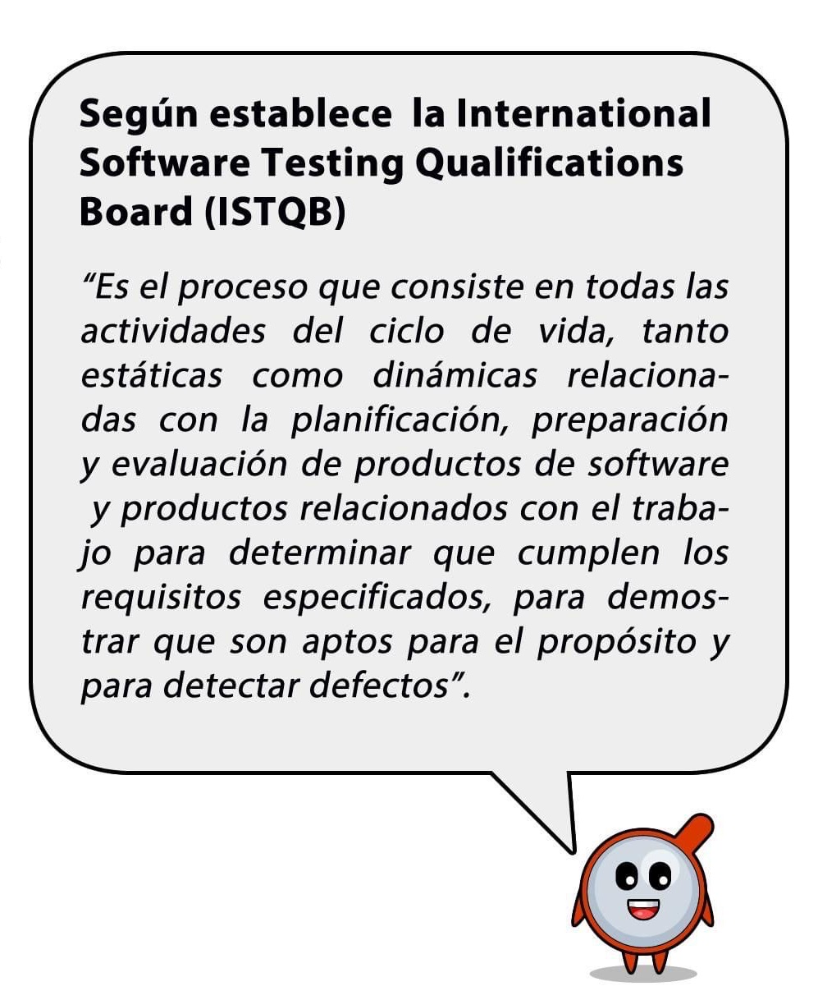
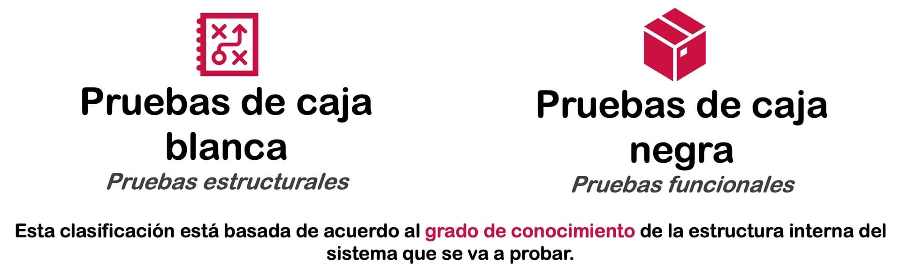
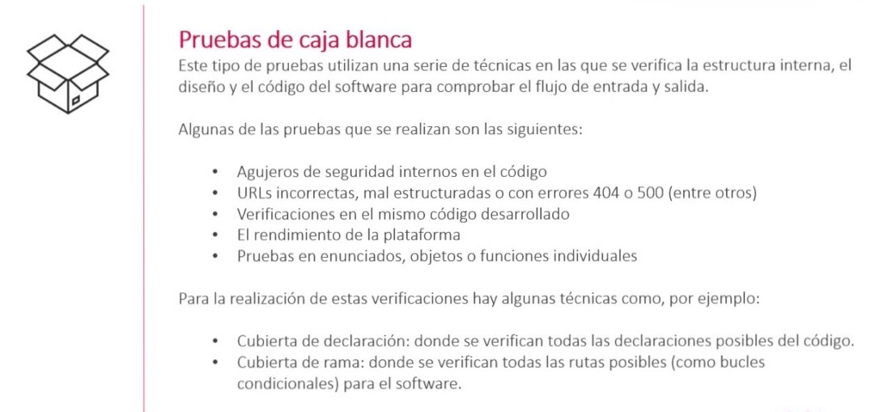
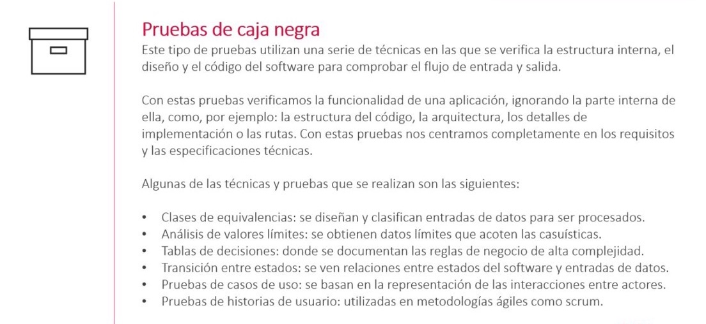
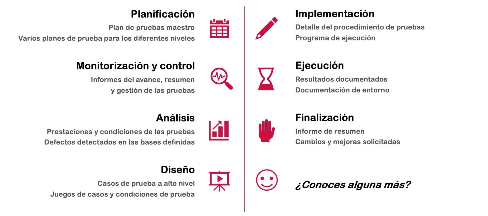
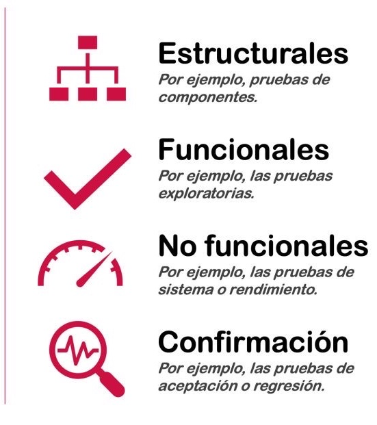

# Pruebas de Software

## ¿Qué son las pruebas de software?

* Es la validación y verificación de un sistema con intención de encontrar errores, mediante el uso de procesos, procedimientos, técnicas y herramientas.

## ¿Cómo se clasifican las **pruebas de software**?

### ¿Qué son y cómo se realizan las pruebas de **caja blanca**?

### ¿Qué son y cómo se realizan las pruebas de **caja negra**?

## ¿Conoces las **fases básicas** de un proceso de pruebas?

## ¿Conoces los cuatro tipos de pruebas de software dinámicas?

