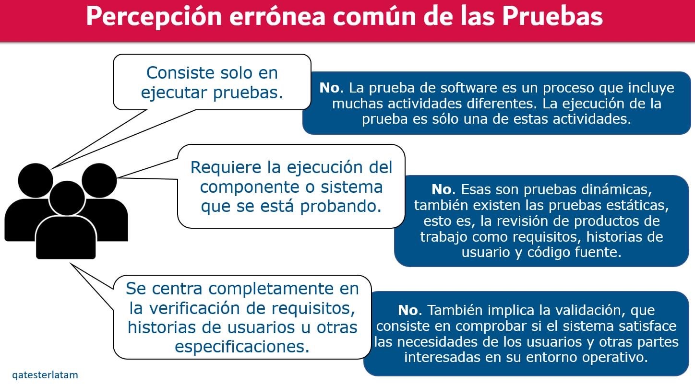
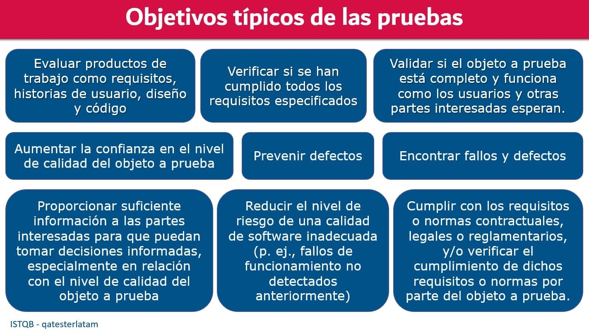
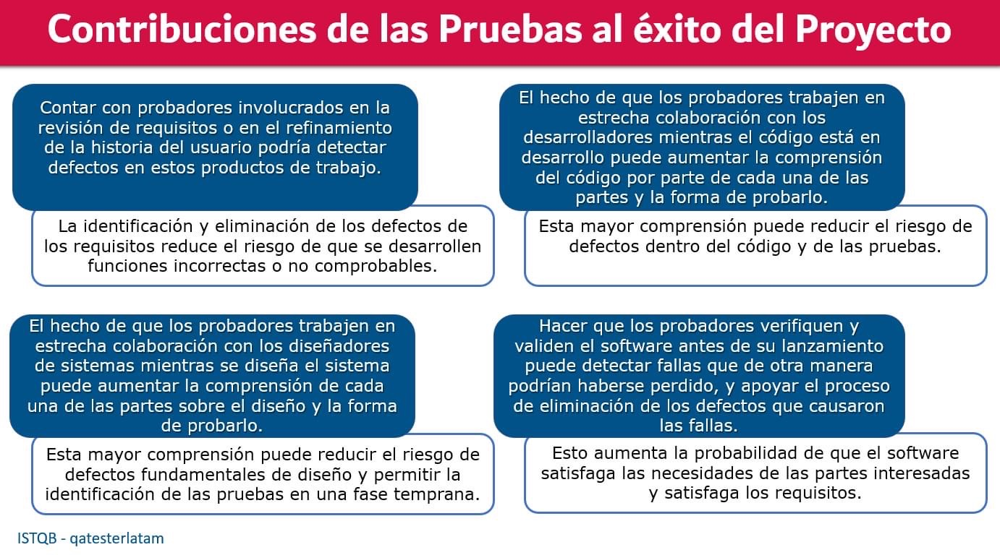
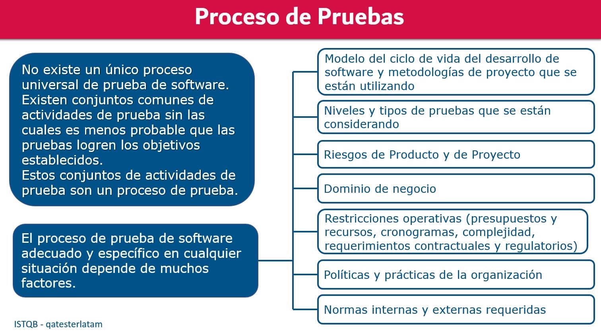
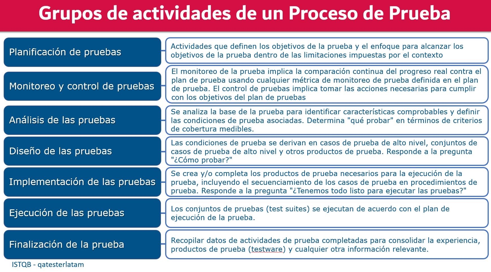
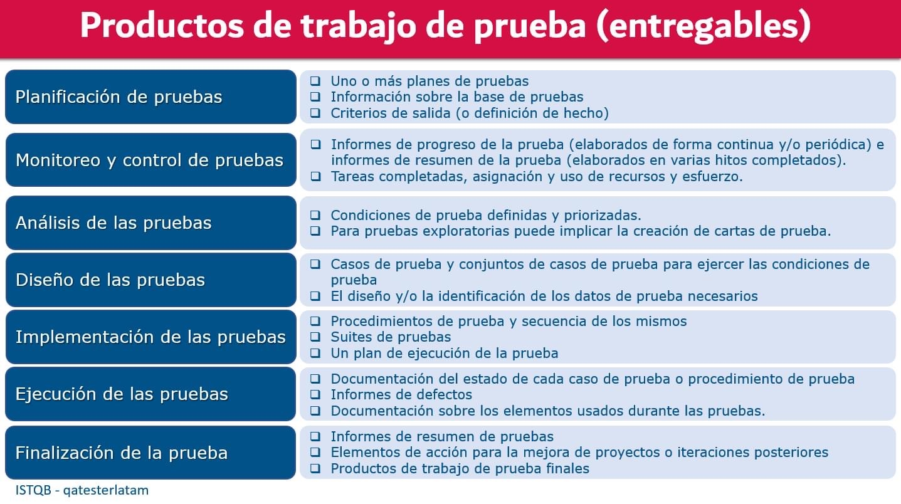
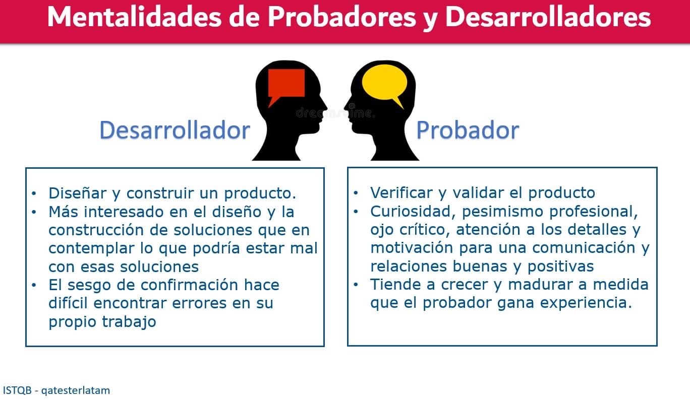
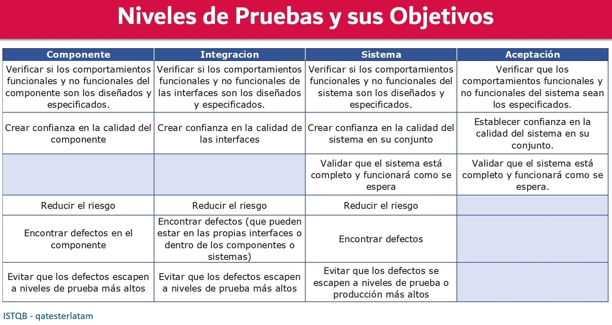
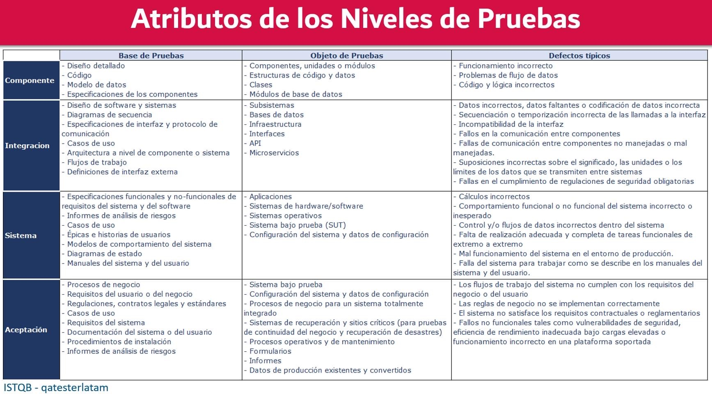

# Pruebas de Software

## ¿Qué son las pruebas de software?

* Es la validación y verificación de un sistema con intención de encontrar errores, mediante el uso de procesos, procedimientos, técnicas y herramientas.

## Percepción errónea común de las pruebas

## Objetivos típicos de las pruebas

## Contribuciones de las pruebas al éxito del proyecto

## Proceso de pruebas

## Grupos de actividades de un proceso de prueba

## Productos de trabajo de prueba (entregables)

## Mentalidades de testers y desarrolladores

## Niveles de pruebas y sus objetivos

## Atributos de los niveles de pruebas

## Macrotipos de las pruebas de software

* **Functional Testing**: comportamientos. Comprobar que se hagan las cosas que dicen los requerimientos.
* **Non-Functional Testing**: estructura. Comprobar que tanto aguanta el software: Stress. Resistencia. Security. Usability.
* **Maintenance Testing**: cuando ya esta listo, comprobar ciertos chequeos.

## ¿Cómo se clasifican las **pruebas de software**?

### ¿Qué son y cómo se realizan las pruebas de **caja blanca**?

### ¿Qué son y cómo se realizan las pruebas de **caja negra**?

## ¿Conoces las **fases básicas** de un proceso de pruebas?

## ¿Conoces los cuatro tipos de pruebas de software dinámicas?

