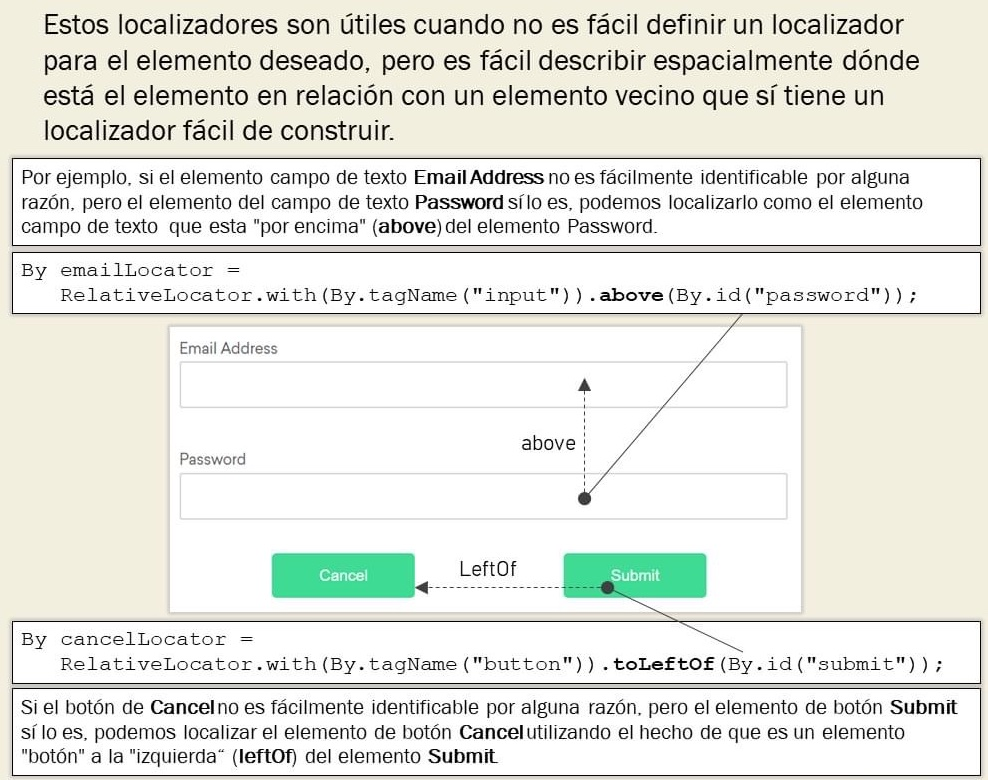
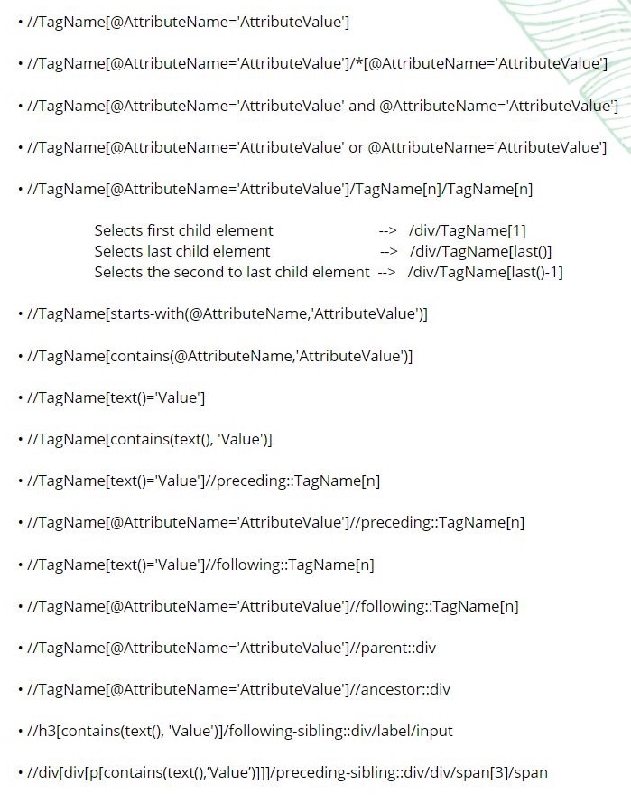

# Selenium

* Es un framework de pruebas de software para aplicaciones basadas en la web.
* Selenium WebDriver: maneja un navegador de forma nativa, como lo haría un usuario, ya sea localmente o en una máquina remota usando el servidor Selenium.


## Razones para usar Selenium


## Multilenguaje en Selenium


## Arquitectura de Selenium WebDriver


## Estrategias de selección de elementos web


* Ejemplo input:

    ```html
    <input id="F1:username" name="F1:username" class="form-control" maxlength="11" size="11" type="number">
    ```

1. id

    ```python
    driver.find_element_by_id("F1:username")
    ```

2. name

    ```python
    driver.find_element_by_name("F1:username") 
    ```

3. xpath

    ```python
    driver.find_element_by_xpath("//*[@id='F1:username']")
    ```

4. class_name

    ```python
    driver.find_element_by_class_name("form-control")
    ```

5. tag_name

    ```python
    driver.find_element_by_tag_name("input")
    ```

6. css_selector

    ```python
    driver.find_element_by_css_selector(“#F1:username”)
    ```

* Ejemplo: link

    ```html
    <a href="https://www.afip.gob.ar/claveFiscal/recupero.asp">¿Olvidaste tu clave?</a>
    ```

1. link_text

    ```python
    driver.find_element_by_link_text("¿Olvidaste tu clave?")
    ```

2. partial_link_text

    ```python
    driver.find_element_by_partial_link_text("¿Olvidaste")
    ```


## Elementos dinámicos en Selenium


## Waits

* time.sleep(n)

    ```python
    import time

    driver.find_element_by_xpath("//*[@id='F1:btnSiguiente']").click()
    driver.find_element_by_xpath("//*[@id='F1:password']").send_keys('Afip123456!')
    time.sleep(1)
    driver.find_element_by_xpath("//*[@id='F1:btnIngresar']").click()
    ```

* Implicit wait

    ```python
    driver = Firefox()
    driver.implicitly_wait(10)
    driver.get("http://somedomain/url_that_delays_loading")
    my_dynamic_element = driver.find_element(By.ID, "myDynamicElement")
    ```

* Explicit wait

    ```python
    from selenium.webdriver.support import expected_conditions as ec
    from selenium.webdriver.support.wait import WebDriverWait

    driver.find_element_by_xpath("//*[@id='F1:btnSiguiente']").click() 
    driver.find_element_by_xpath("//*[@id='F1:password']").send_keys('Afip123456!')
    ele = driver.find_element_by_xpath("//*[@id='F1:btnIngresar']")
    wait = WebDriverWait(driver, 5)
    wait.until(ec.element_to_be_clickable(ele)).click()
    ```

* Fluid wait

    ```python
    from selenium.webdriver.support import expected_conditions as ec 
    from selenium.webdriver.support.wait import WebDriverWait

    driver.find_element_by_xpath("//*[@id='F1:btnSiguiente']").click()  
    driver.find_element_by_xpath("//*[@id='F1:password']").send_keys('Afip123456!') 
    ele = driver.find_element_by_xpath("//*[@id='F1:btnIngresar']") 
    wait = WebDriverWait(driver, timeout=10, poll_frequency=1, ignored_exceptions=[ElementNotVisibleException, ElementNotSelectableException])
    wait.until(ec.element_to_be_clickable(ele)).click()
    ```

## Localizadores relativos




## WebElement


## Data-Driven Testing en Selenium


## Buenas prácticas en Selenium


## XPath




