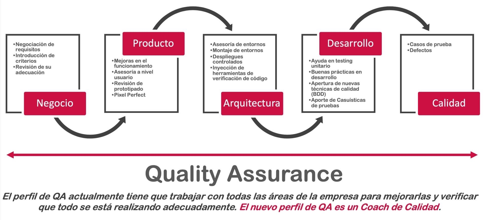
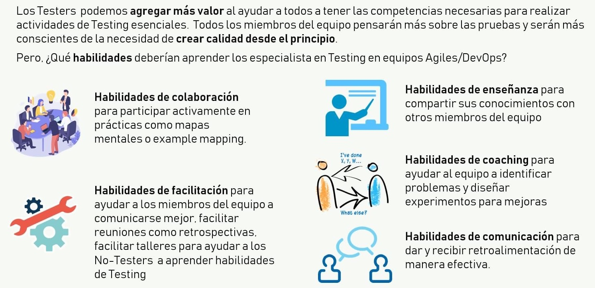
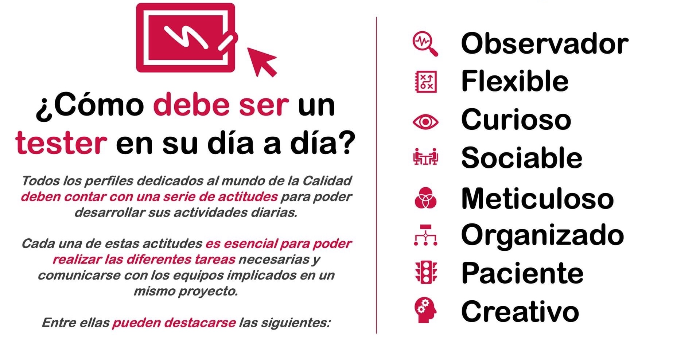
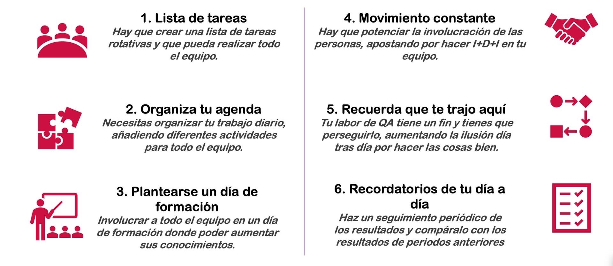
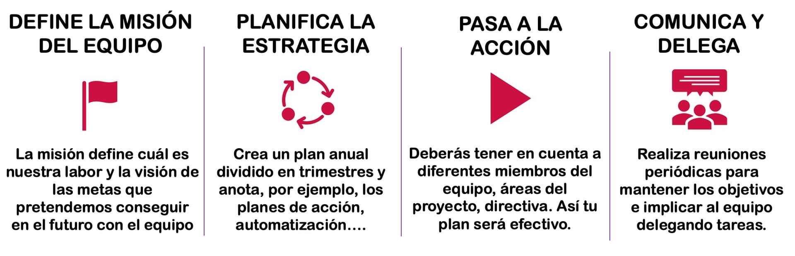
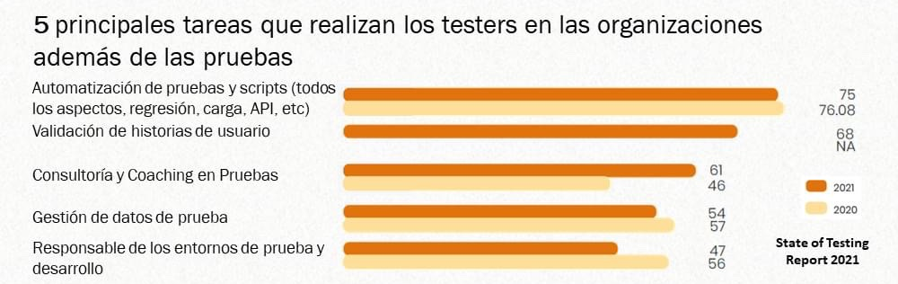

# Tester

## ¿Cómo puede **participar** el Tester a lo largo de todo el **proceso**?

## ¿Cuál es el **papel del tester** en un equipo ágil?

## ¿Cómo **debe ser** un **tester** (actitudes) en su día a día?

## ¿Cómo hacemos para mantener la **pasión del equipo de QA**?

## ¿Cómo **motivar** e **implicar** a tu equipo?

## ¿Cuáles son las principales tareas que realizan los testers en las organizaciones además de las pruebas?

