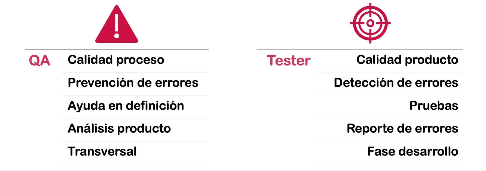
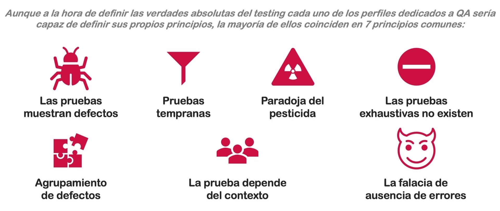

# Testing

## ¿Conoces las diferencia entre **verificación** y **validación**?

## ¿Cuál es la **diferencia** entre **Calidad** y **Testing**?

## ¿Qué son los **atributos** de calidad?

## ¿Qué **tareas** se hacen en **QA** y cuales en **Testing**?

## ¿Qué **beneficios** nos aporta un proceso de **calidad de software**?

## ¿Qué aportan las **pruebas** en un producto de software?

## ¿Conoces las **verdades absolutas** (principios) del Testing?

## ¿Cómo puede **participar** el Tester a lo largo de todo el **proceso**?

## ¿Cómo **debe ser** un **tester** (actitudes) en su día a día?

